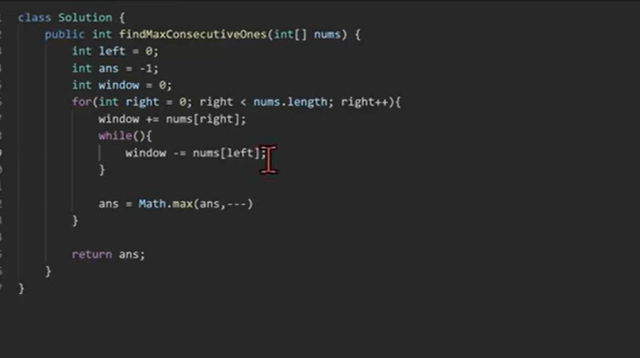

Sliding Window Common Problem 
------------------------------
finding maximum consecutive ones
in this example there will be a given binary array and we have to find maximum consecutive ones

so we can see what will be the answer will come will be the subarray of a given array

*** always remember whenever any question will come like a subarray kind of always try to remember
can we solve using sliding window.

*** In a sliding window there will be a window which will be getting slide
suppose in start in a window there is only 1 and second time 1 1 came, so at first 1 came was our answer obviously
so 1 time 1 came so our answer is 1 which is in our window then our sliding window become 1 1 so earlier was 1 and now 1 1
so from both which is maximum so our answer is 2, 

*** then our sliding window will become 1 1 0 now our condition not getting match so whenever condition not matched
we will go back and start removing element from our window after removing we can see we have 1 0 but still condition not match
so again remove element from left and now we have element in window is 0 but still condition not match so remove this element as well.
so our answer is still 2 because in our window still max is 1 1 so now our window got over.

*** so again a new window will open with 1, 1 1 and 1 1 1 so here in our window maximum is 3 earlier was 2 so answer will be 3.

# Important -

To solve a problem using sliding window follow below steps

# 1 pointer from left
# 1 pointer from right
# we have to move right pointer and take that right pointer and put in an answer field
# In our window we will add right element
# we will put a condition when ever condition not met then we will destroy from the sliding window and increase left pointer
# and update the answer

now our window is sum it could be product or anything

# the important thing is what would be the condition here

that is the most important thing

# so always it should be in a consecutive like 1 1 1 1 how we can write in a condition

# In our case sliding window sum will be 2 and length also will be 2

# Time Complexity-

    Because of 2 loops looks like O(n*n) 
 
  but time complexity = O(n)

   
   
 # O(n*n) will happen in case for an outer loop the entire inner loop will run
 # But we can see here for an outer loop inner loop running a constant times
 # right pointer is executing from 1 to n but which is not obvious is left pointer
 # we can see left also iterating from o to n only so right pointer is also moving to n time and left pointer also moving to n time
 # which mean O(n)

