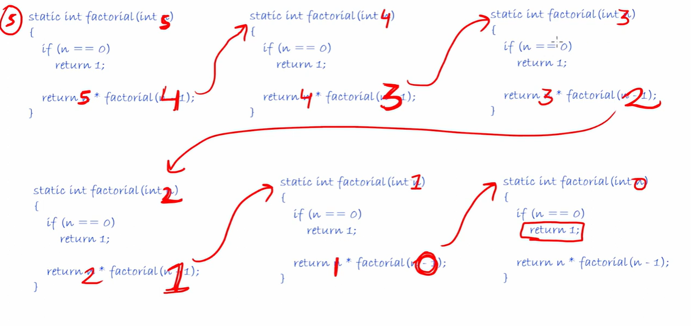

Recursion is a way while we divide a bigger problem to a small problems
and the Result of a Bigger problems depends on a result of a small problem

In a Recursion we should know when we have to stop the execution otherwise it will execute infinite times and ends with stackoverflow error

Important:

so, now factorial(5) is waiting for a factorial(4), factorial(4) is waiting for a factorial(3),
        factorial(3) is waiting for a factorial(2), factorial(2) is waiting for a factorial(1),
        factorial(1) is waiting for a factorial(0).....................

   Which mean all functions are waiting for each-other results.

   That's the reason we put base condition, because base case break the condition otherwise it will cause for a stackoverflow error.

   Every Function is waiting for their separate copy

   

   Time Complexity - O(n)

   Space Complexity - we are not taking any extra space but there are many functions which is in waiting states where they are
                      getting store they are storing in a STACK and the size of a stack would be How many times functions
                      are getting called so n times called so space complexity - O(n). 

   In case of Iterative approach Time Complexity - O(n) and Space Complexity - O(1)
   
   But in case of Recursion we are taking more space, we are not occupying any auxiliaries space but for recursion stack taking space.
   
   Time to pause : 5:54