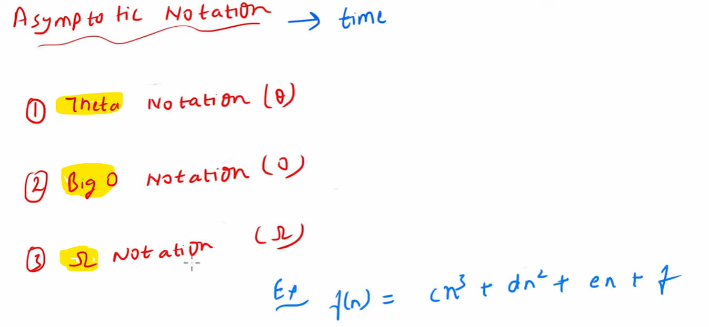

# Time Complexity

   How much time algorithm will take to run.
   
   To solve a problem P we have 3 algorithms A1, A2 and A3, how we can decide which algo is the Best.
   
   
   
   Then we will have to consider 2 things and we have to consider both of them:
        - Time Complexity 
        - Space Complexity
   
   *** To Identify which algo is the best we will find all 3 algo Time complexity and space complexity
   *** Which algo will take less time and less space i will choose that algo only.
   
   # Linear Search Example

   An Array Given & An Element Given need to check Element present in that array or not.
   
   
   Every Algo having  3 cases Best/ Average / Worst Case
   
   Element - 3, found at first place/iteration so Best case
   Element - 7, found at last place/iteration so Worst case because all elements get traced
   other than that will be the Avg Case.

   # Real time use case

   I have developed an API and telling to client this API will give response back in a 1 sec in best case, 
   we should always tell worst case to maximum will take 10 seconds.

   ** we should always see a worst case because best case will always be less than the worst case.
   ** Always we will see a worst case for any algorithm when we will write.
   ** because Worst case will tell the maximum time so algo won't take more than that time.

   # Asymptotic Notation

   How we can denote the time taken by any algorithm called Asymptotic Notation.
   All the Algorithms How we are going to write or denote the way of denoting called Asymptotic Notation.
   Asymptotic Notation - denoting the Time

# Types of Asymptotic Notation
   
   - Theta
   - Big O
   - Omega
  

# How we can write Theta, Big O and Omega notation of any algorithm

   suppose we have an algorithm and we are denoting in a below manner
   
   
   What will be the Order or Order of Growth of this Algorithm???

   Order or Order of Growth = On which term this algorithm will highly depend up on.

   
   
   if n = 1 million (1000000)

   which term will impact more on the final answer??

   
   
   Algo: Order of Growth = n3, and we can neglect n2 and n.

   Order of Growth = n3 = degree of polynomial

   our algo will highly depend up on n3 because c is a constant so not considering 

  # Now Let's see Asymptotic Notation : Theta, Big O and Omega notation
   
   

   # Theta Notation

   Theta Notation = Actual Order of Growth  = Actual Order of Algorithm

   
   
   
   # Big O Notation

   Big O Notation >= Actual Order

   Big O notation will always be either equal to or greater than the actual order 
    
   so either it could be O(n3) | O(n4) | O(n10) | O(n10000000)......anything greater than actual order consider Big O.

   we are not telling the exact we are telling more than approx time. 

   
    

   # Omega Notation

   Omega Notation <= Actual Order

   Lowe than the actual order 

   so either it could be O(n3) | O(n2) | O(n1) | O(1)......anything lower than actual order consider Omega notation.

  

  

  *** whenever we will have any complex algorithm in that case we can't calculate exact time so that's
    the reason we try to find either Big O or Omega not Theta(exact actual order).

  Asymptotic Notation - The way of writing any Time Complexity.

  Theta - actual order = exact time
  Big O - more than exact time = greater than theta
  Omega - less than exact time = less than theta  
   
  ** Most Important = Big O = Upper Bound of an Algorithm = Worst case of an Algorithm
                            = Actual time will always be the lesser than this 
                            = will tell to client algo won't take more than this time
                            = we always tell more than the actual time to the client for a big trust
                            = This will be the Worst Case algo will never take time more than this in any situation.
  
  # Order of growth comparison

   

   suppose we have an algorithm, we can denote that algorithm in a form of polynomial.   

   order of growth = degree of polynomial.
   
   
   

  # Order of growth uses in an algorithm.

   representing an algorithm in a below form
   
   
   
   find Big O notation ???
   
   first we will see what would be the order of growth??
   
   order of growth = maximum time depend on which term
   
   Theta = actual order =
   
   
   
   Big O = greater than actual order =
   
   
   
   Omega = lesser than the actual order = 
   
   
   
   
   # Find Big O notation of some algorithms?????

   # Algorithm : 1

   

   Time Complexity - O(n)

   # Algorithm : 2 (outer loop = add)
   
   
   
   Time Complexity = O(n+m)
   suppose there is a 2 outer loop with n, O(n+n) = O(2n) = O(n)                

   # Algorithm : 3 (inner loop = multiply)

   

   Time Complexity = O(n*m)
   suppose inner loop also from 1 to n, O(n*n) = O(n2)

   # Algorithm : 4 ( power(i,c) )

   
   

   when we were having loop like i++ then we can say it will go till n, but here it's difficult
   because everytime we are doing power so in this kind of question first we will see what is the value of i
   and, we can find the maximum value of i would be this below one
   
   
   so always we need to see what would be the maximum value of i, 
   

   so maximum value of i which is just less than n,
   and now we can just simplify this
   
   
   so i will run till k and value of k is 
   
   
   Time Complexity = O(log(log n))
   

   # Algorithm : 5 ( recursion fibonacci)
   # How to find Time Complexity of Recursion series

   
   
   
   important - whenever we are not able to find how many times loop will run then we have to find last value of i
               which mean what would be the maximum value of i.
               
   Nth Fibonacci would be fib(n) = fib(n-1) + fib(n-2)   -> this is called recurrence relation
   
   
   
   
   