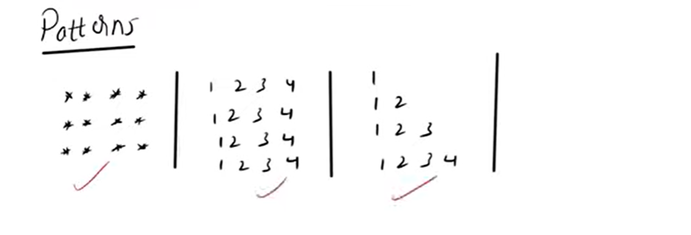
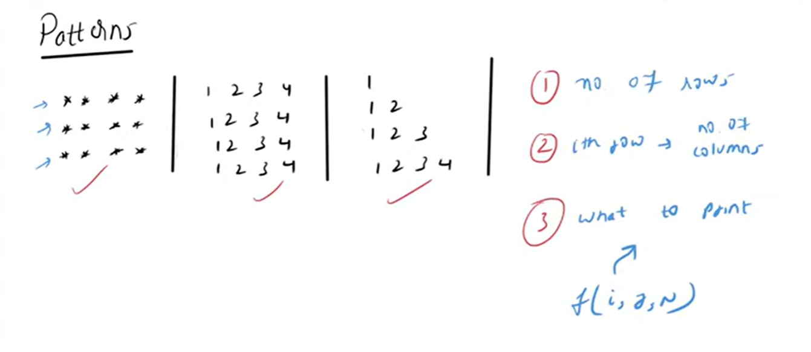
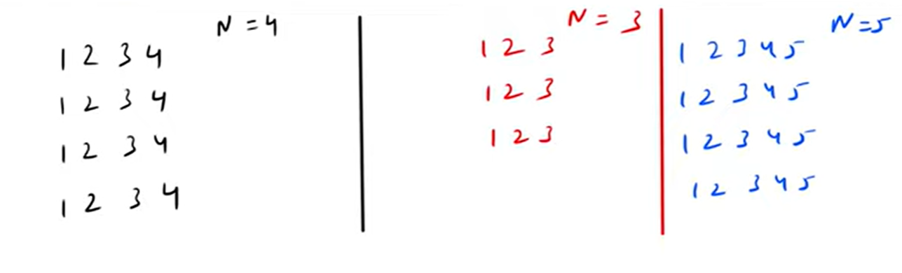
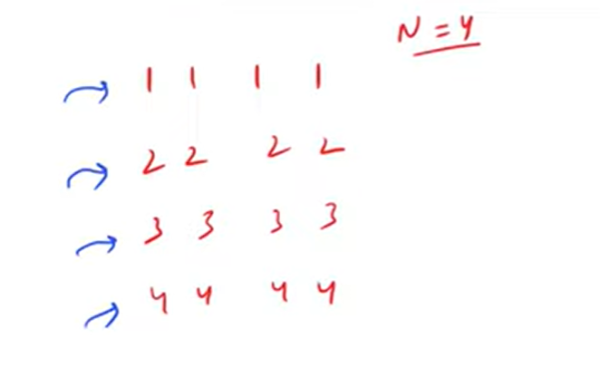

If you are trying to write a logic for a Pattern type of problems always remember 3 things 

   1. How many number of rows.

   2. In every row how many number of columns
       i th row -> no. of columns

   3. What to print that will be the function from either f(i, j, n)

