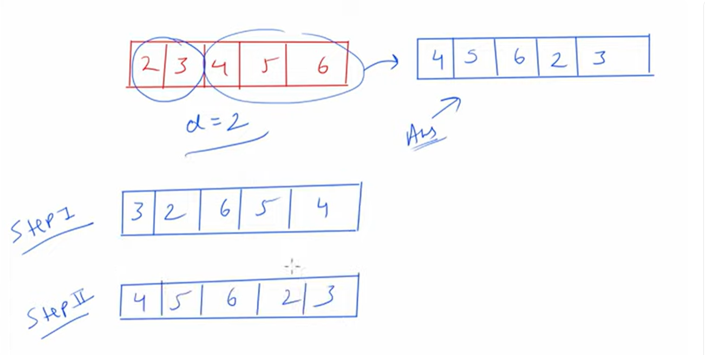

Problem statement

array = 2, 3, 4, 5, 6,
Left Rotation
Rotation Point d = 2
output = 4, 5, 6, 2, 3

Time Complexity - O(n) because iterating till end elements
Space Complexity - O(1) because we are not going to take any additional array in a same array we are looking to implement