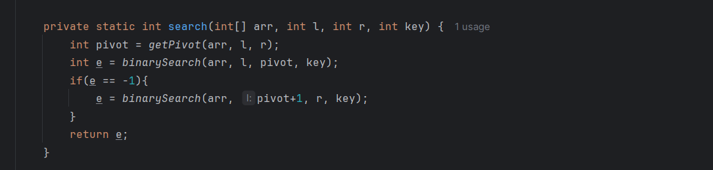

Given a sorted and rotated array A of N distinct elements which is rotated at some point,
and given an element key. the task is to find the index of the given element key in the array A.

# rotated array - 5, 6, 7, 8, 9, 10, 1, 2, 3 

If it was not rotated array  like - 1, 2, 3, 5, 6, 7, 8, 9, 10

then we can simply apply binary search and get output

But here it get rotated so we have a problems.

# so what we can do we can apply individual Binary Search

# we can't take a new array in place we have to apply logic

# to apply 2 time binary search we should know the pivot element

# pivot is the element or location in which around our array get rotated

# in this case - 5, 6, 7, 8, 9, 10, 1, 2, 3   - 10 would be the pivot element so bs we will apply from ( l to pivot / pivot+1 to r)

# To find pivot

# To do Binary Search

# apply binary search on both parts before pivot and after pivot

