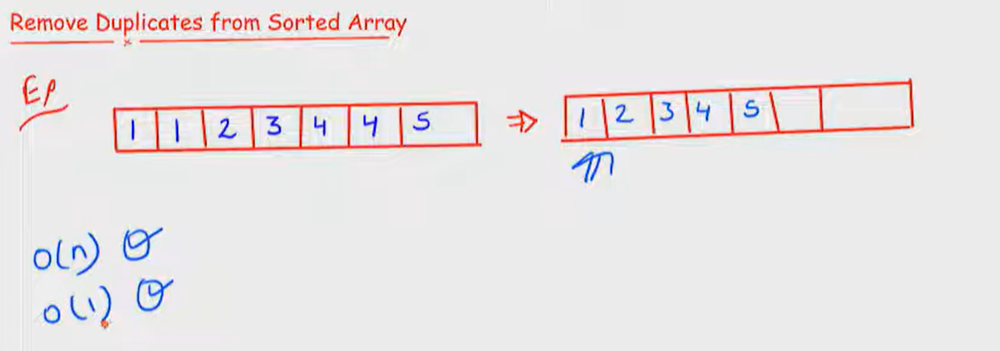
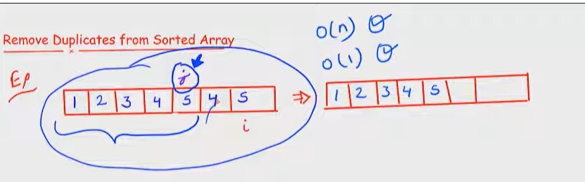

Time complexity - O(n) - within same array need to solve
Space Complexity - O(1)

2 pointer i & j
1 pointer i will get traversed and another pointer j will help to store unique element in array
initially i and j will point to 1st element 
we will check one by one element and check is this element is unique from previous element
if it's not unique from previous element then keep j at same place and increase value of i

If its unique from previous element then i will increase but j will also get increase and in place of j we will
replace with a new i value element

** so i will always increase but j we will increase only in case of we found unique element and then we will place 
the value of i to j.

so, the pointer j will give you the all unique elements from the given array.