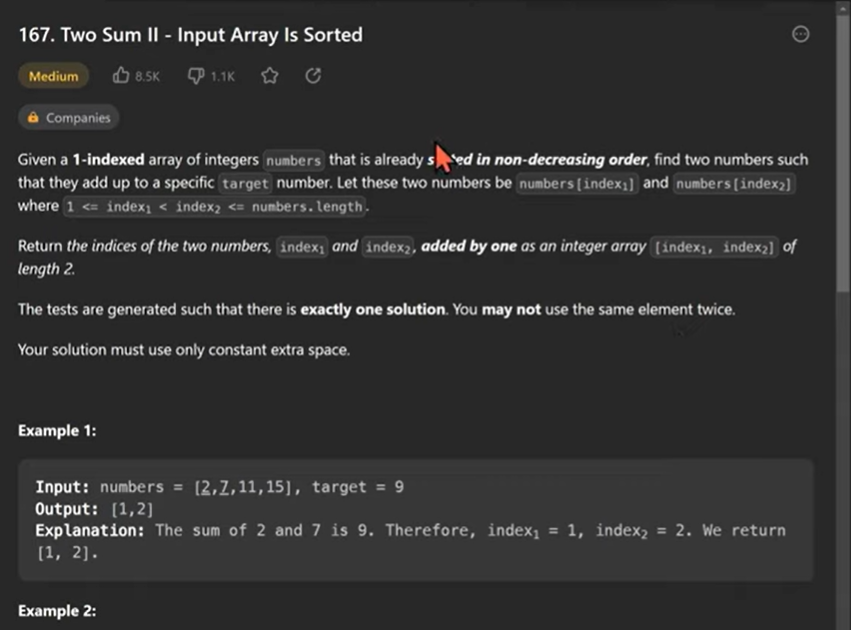

In array, we have a sorted elements

we have to find which 2 numbers sum is equals to the target value

Input = [2, 7, 11, 15]
target = 9

** Important
suppose Input array is not sorted we can use HashMap in that case
while we are seeing the new elements we are keeping in a HashMap and we are looking is (target-current_element) exists
in a hash map??  first came 2 then keep in hash map then 7 came , then we check (target-7) = (9-7) = exist in map??
which mean [2, 7] will be the sum of target.
here we were using auxiliary space  we were taking map extra space. 

In this case we are having sorted array so no need to take extra space.

Given 
    Array - [2, 3, 5, 7, 11]
    Target - 10

Solution - Two Pointer Approach

i-> traverse from left
j-> traverse from right

sum of i = 2 and j = 11 will be 13 so 

13 is greater than target(10), which mean in the sum of both which number shall we remove so that sum will become less 
which mean neglect the maximum number right side number because our array is in a sorted order 

so now i=2 and j=7 and sum will be 9 
9 is less than the target(10), which mean in the sum of both which number shall we remove so that sum will become more
which mean neglect the less-sorter number from left side 

so now i=3 and j=7 and sum will be 10 which is equal to target so return that value.

Time complexity - O(n);
space complexity - O(1) because we are not using any auxiliary space.

