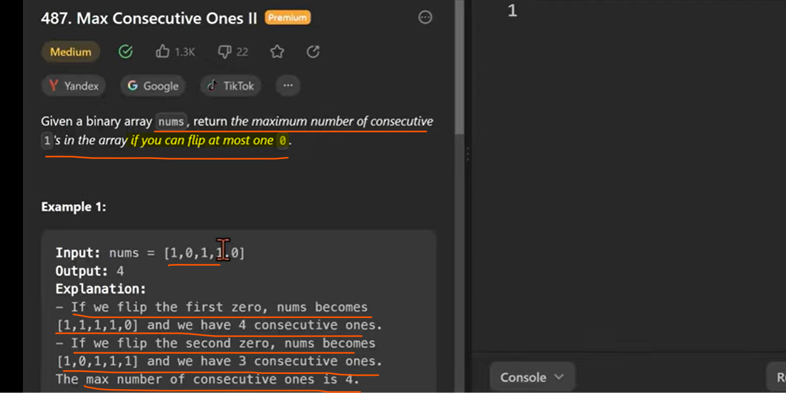
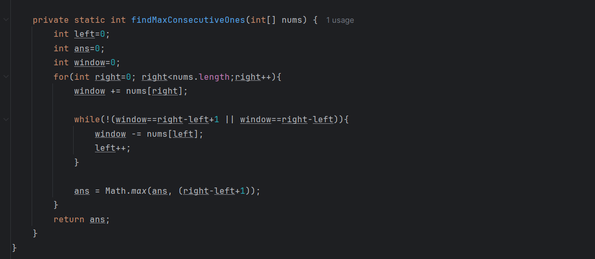

# when ever subarray kind of questions come we always try to use sliding windows.

# In another way we can say find the longest subarray where maximum one 0 present.

 we can flip at most one here.
 
# let's use sliding windows technique how we used earlier let's see.

sliding window looks like below---

solution-

    one by one we will add right pointer element to the window 
    once condition un-satisfied, so here condition is maximum one zero should come, if not satisfied then 
    we start removing from left pointer from a same windows and increase left.

  below will be a base format for any sliding window problems
  
  
  
# condition is : 1 zeros or 0 zeros

here windows is sum or right element so, 
if length is 4 and sum is 4 in a window which mean no zero came in a windows
if length is 4 and sum is 3 in a window which mean maximum one zero came in a windows

