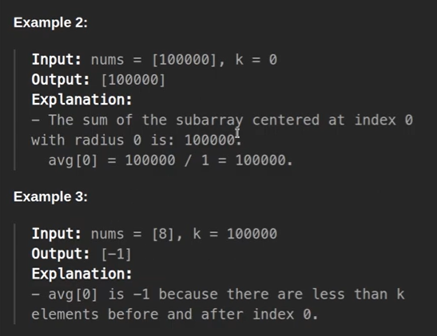
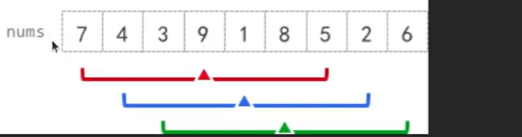
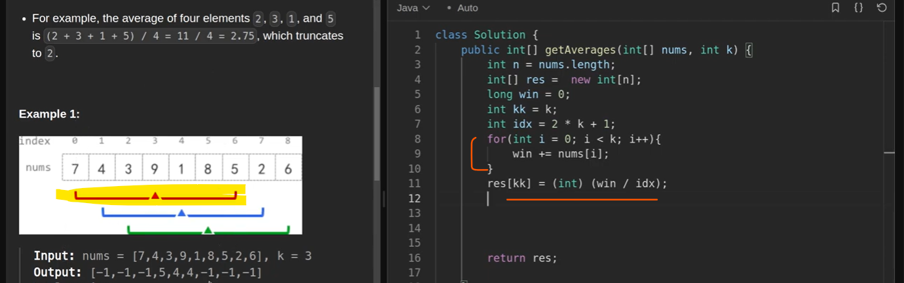
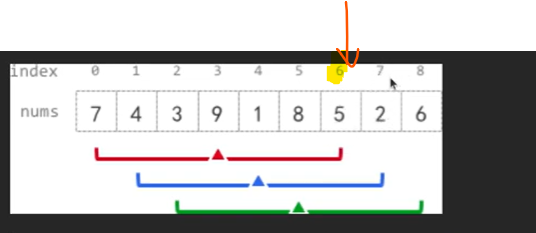
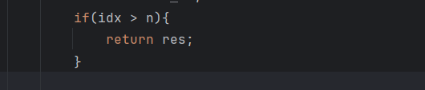
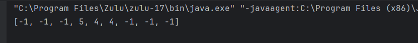

array = [7,4,3,9,1,8,52,6]
k=3

output - [-1, -1, -1, 5, 4, 4, -1, -1, -1]

you have to find that Index from where in left side you can see 3 elements and from right also you can see 
3 elements.

subarray = [7,4,3,9,1,8,5]
pivot = 9
suppose you have a 9 in a given array so from 9 there are 3 elements in left and right side, it can be more
than 3 elements but should not less than 3 elements.

if i take 9 as a pivot so in left and right 3-3 elements are there.
then these 7 elements will perform a subarray, and we have to find the average of 7 and that average
we have to put at middle/at pivot/at mid-position.

Now we have to move that subarray now our new subarray will be 
new subarray - [4,3,9,1,8,5,2]

new average will put at 

In case of subarray problems - we should go for Sliding Windows Approach.

# Important:

   I will create a first sliding window and that i will start moving 
   later i will start removing left elements 
   and start adding right elements
   our first sliding window will be - 2 * k +1 = (2*3+1)=7
   
   
   
so our first sliding window will be like

now first sliding window answer(35/7 = 5) where we can keep we have to keep at k=3 rd position

we have done the changes for a red mark one now we will move forward we will add right element and remove left element

now we are at 6th index which mean at 6th position now we have to start from 7 so for second loop will start from idx

earlier we went to idx till 7 now we will start from 7. now for second window i have to remove 1st left element and add next
right element how we can find 1st array element
idx=(2*k+1)=7
i=start from 7
remove num[0] = num[i-idx]=num[7-7]=num[0]
add num[7] = num[i]

we are running 1st window loop to idx only till 2*k+1 = 7
suppose k =1000 and nums length is 1 so we will get IndexOutOfBound Exception so we can ass one condition

now we have rest of left and right side element by default 0 so me need to make it -1.

so, let's fill our resultant array with -1 from starting itself.

