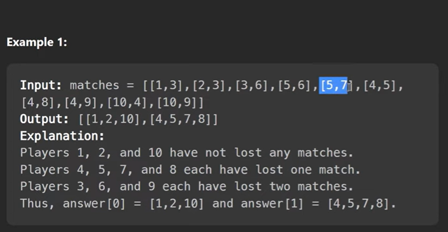
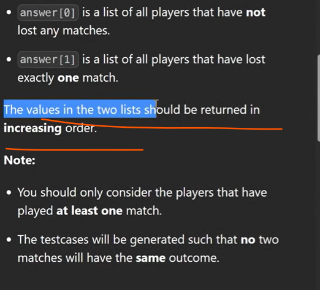

we have just created a map which team how many time loses

TC : zero loses list we will not consider in our tc bcz that is not part of our answer
      we will only consider list oneLoses
      O(n) + n log n for sorting
      n log(n)
    

SC : if we have n unique player then O(n)