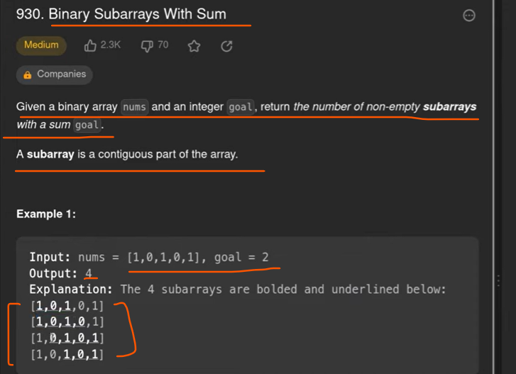
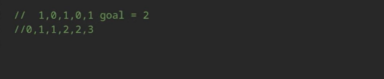

# Note

  When we do have a strict restrictions then we can use hashMap as we saw Earlier in 
  
  When we have Less Restrictions or loose conditions like less than or equals then in that case we can use Sliding Window approach
  
  # so we can use the prefix sum approach

