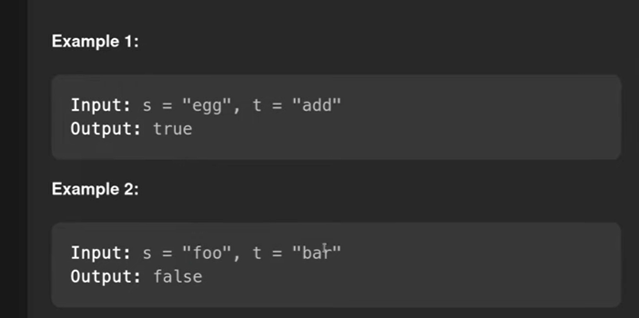
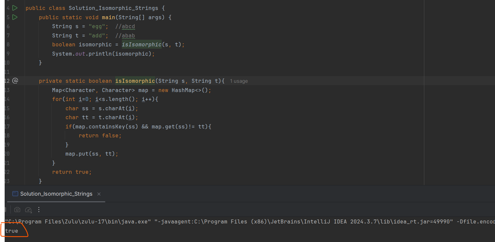
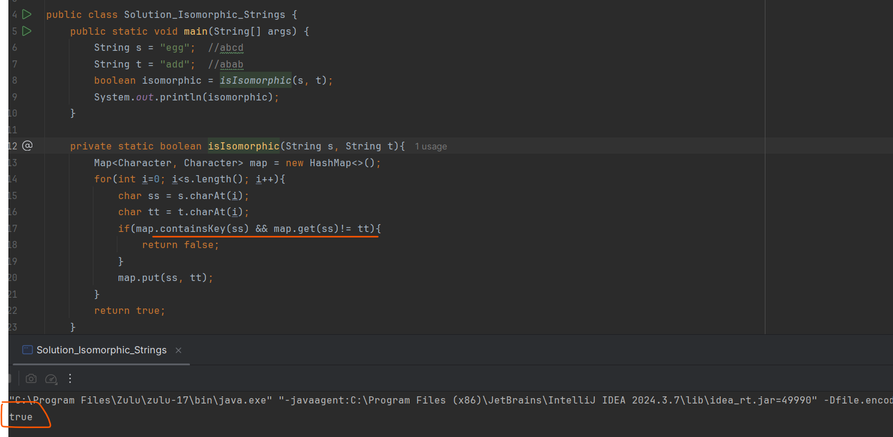
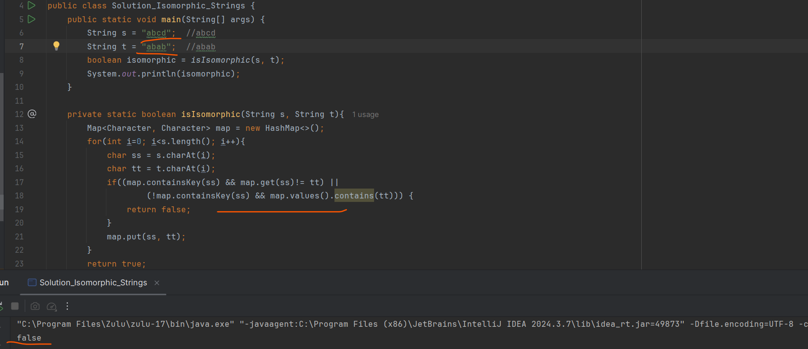

It should have one to one Mapping.

# Exceptional case But, In case s = "abcd" and t = "abab" will return true but it should be false

earlier above one was giving true

# Space Complexity

Space complexity will be O(n) not even Big (n) so How many ascii character consists that much length
so How many valid ascii characters that much lengths will happen

# Time Complexity
 we are using containsKey() and get() will happen in O(1)

 
# Second Approach [ Count Array ]

 since we are having a limited no. of characters so we can use count array

 In our ASCII table total no. of character will be 256

 filled default with -1 because -1 is not any ascii value of any character

 
 
Time complexity O(n) because how much length string
Space complexity O(1)
