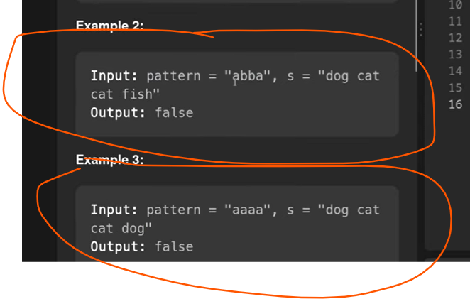

Bijection Means one to one mapping should be happened from pattern to given string and vice versa

# This problem exact similar as previous problem Isomorphic Pattern

Earlier we will have Character to Character Mapping

In This Problem we do have Character to String mapping

# Time and Space Complexity

There is one loop for pattern's length 
when we split then also one loop will run so O( p + s)
O(n) = O(p + n)

# Space Complexity

suppose we have a unique characters in pattern 
so arr size will be the size of string s which we have unique O(s)
+
Map elements what we are putting character of pattern which is unique - p, O(p)

Total Space - O(s) + p

TC- O(n)
SC- O(n)

Map has been created from lower case character from 1 to 26....O(26) map size
so the main space occupied by s which is the size of arr, so we can say O(s)

SC - O(s)
