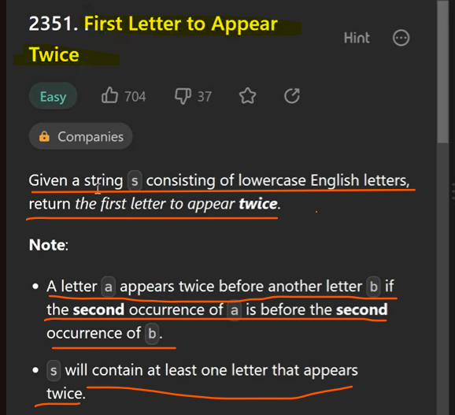

Input s = "abccbaacz"
Output = "c"

Time complexity = O(n) - If character length is 10 then 10 times loop will execute 

Space Complexity =  O(1) or we can say O(26)  - we are using set so, no duplicates and total number of possible character in set will be 26, from A,B...Z.
