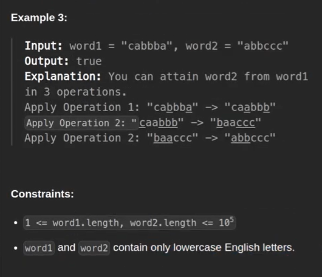

this is a tricky kind of question
to solve this question 
- 1. both given string length should be same
- 2. both given string should have same number of characters
- 3. both given string frequencies should be same

# Time complexity

Time complexity is Big of n mean O(n) which is applicable on a below code snipts

In below code snipt it's a constant because of 26

In below code snipt also constant because it would be n log(n) but n is 26

TC - O(n)

# Space Complexity 

Space Complexity - constant space,  because of O(26) 