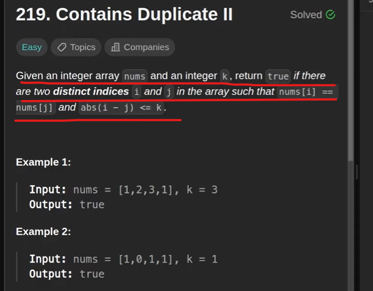

# Way : 1 - Using Map

Time Complexity = we are storing elements in map so O(n)
Space Complexity = In case all unique elements our HashMap size will be all no. of unique elements contains

# Way : 2 - Using set  - We can use Sliding Approach 

Space Complexity we can reduce using SET

Time Complexity = Big of N, equals to the size of an array
Space Complexity = space complexity will be equals to size of nums array or size of k
                   size of window will be if k is small then equal to size of k
                   if window size is greater than a nums array size then will be equal to nums size
                   

