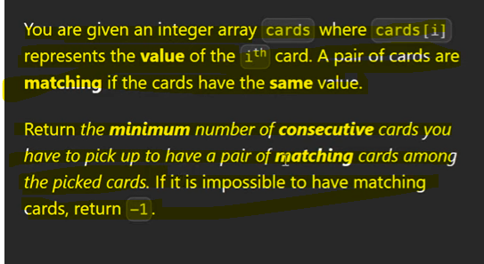
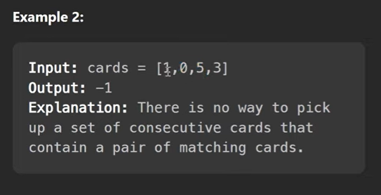
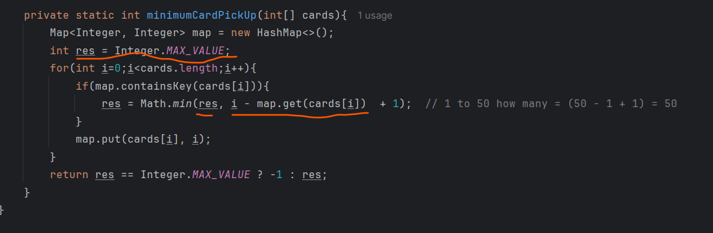

We need to find minimal length of subarray where we found 2 cards are same.

Time Complexity = O(n)  = because of one loop we used

Space Complexity = O(n)  = because of one map we used and all elements may be unique in a map

# Important - 

we are taking res as a default Integer Max value because we need to find the minimum value using 

Math.min(res, derived-value)

so if we take res as 0 so always it will print 0 as a minimum result 
so when it won't found minimum then we can give -1 as a MAX.

