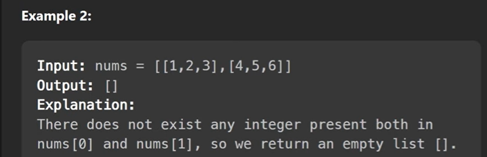

use map
check if number of element count is equals to the size of a given array
so in an example we do have 3 arrays

Time Complexity = m * n - where m is inner size array, n is outer size array

        and for sorting and filter how much time it will take

        suppose we are filtering k number of elements k + k log k = k log(k)

Time Complexity = m * n + ( k log(k))

Space Complexity = space complexity depends on how many unique elements will be there
                   so in a worst case all elements will be unique so hash map size will also be that same length 
                   O(n)

