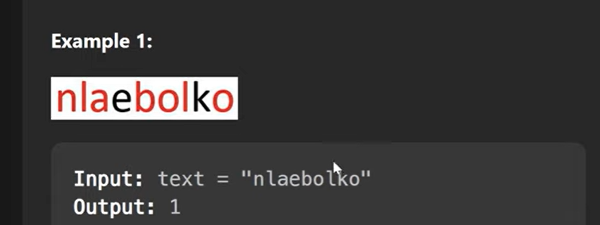
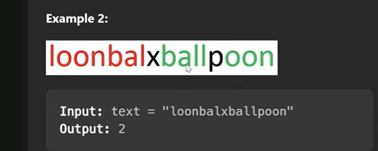

have to find how many balloons we can make using given Text

so Balloon will create once we have a-1, b-1, l-2, o-2, n-1

if we have a 1 and b 8, then also we will create only one balloon because to create a 8 balloon we need 8 a and other words

T C - O(n)
S C - O(1)

