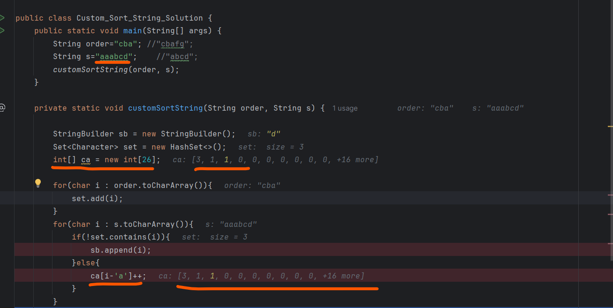

we do have 2 string order and s

all character of order string should be unique
so we have to see order character and in which order, order character is coming in the same order s character also should be there

so here abc we can put in a same order because it present in order string order and the position of d we can put anywhere in a string.
in middle if any character will come it doesnot matter.

Very Important Concept->

If you have a string like - String str = "aaabcd";
*** If you want to count How many times any character came in a string you can find in an easy way like below
    
    String str = "aaabcd";
    int arr[] = new int[26];
    for(char i: str.toCharArray()){
    {
        arr[i-'a']++;
    }

    arr[i-'a'] = if i-> g  = 103-97 = 7 = arr[7] = g

Time Complexity - O(n)  = n+n+n

Space complexity - Constant - because 26 alphabet character is a constant and set is also a constant

space complexity = O(1)

