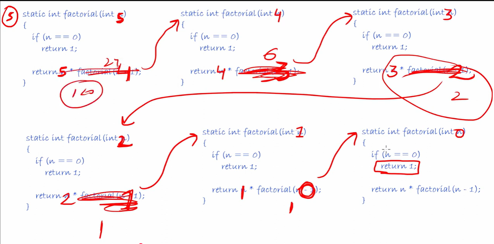
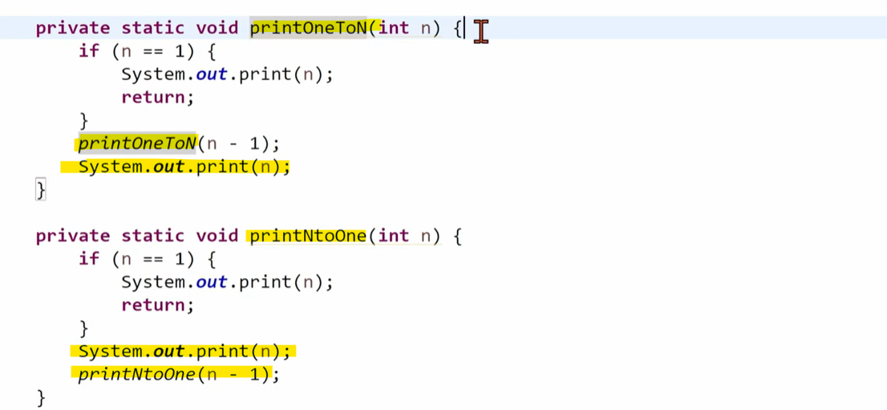
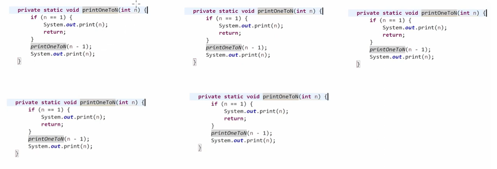
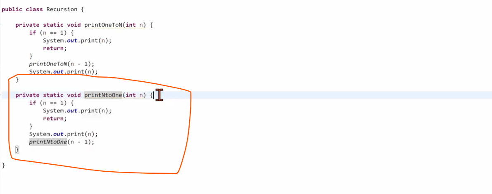
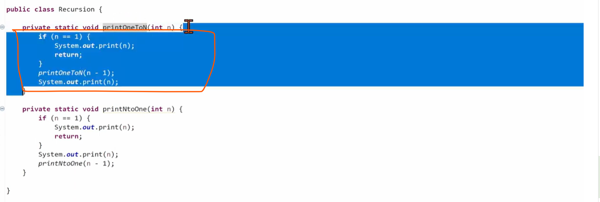
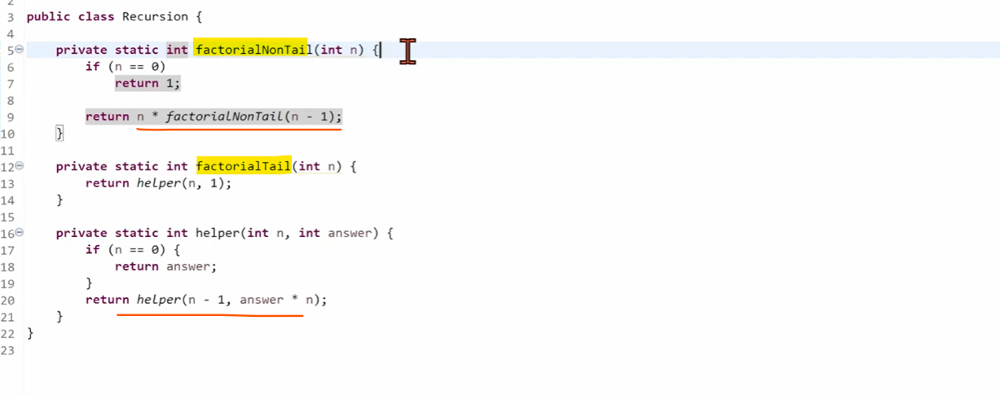

Recursion is a way while we divide a bigger problem to a small problems
and the Result of a Bigger problems depends on a result of a small problem

In a Recursion we should know when we have to stop the execution otherwise it will execute infinite times and ends with stackoverflow error

Important:

so, now factorial(5) is waiting for a factorial(4), factorial(4) is waiting for a factorial(3),
        factorial(3) is waiting for a factorial(2), factorial(2) is waiting for a factorial(1),
        factorial(1) is waiting for a factorial(0).....................

   Which mean all functions are waiting for each-other results.

   That's the reason we put base condition, because base case break the condition otherwise it will cause for a stackoverflow error.

   Every Function is waiting for their separate copy

   

   Time Complexity - O(n)

   Space Complexity - we are not taking any extra space but there are many functions which is in waiting states where they are
                      getting store they are storing in a STACK and the size of a stack would be How many times functions
                      are getting called so n times called so space complexity - O(n). 

   In case of Iterative approach Time Complexity - O(n) and Space Complexity - O(1)
   
   But in case of Recursion we are taking more space, we are not occupying any auxiliaries space but for recursion stack taking space.
   
   
 # Recursion Types

  1. Tail Recursion
  2. Non - Tail Recursion

   # we have 2 programs
   - print 1 to N 
   - print N to 1, both we have to print using a RECURSION.
   
 
 
 
 
  # Print 1 to n
    
   
   
   
   
   
   
  # Print n to 1

   for n to 1 only 1 line change like just before recursion call print that data.
   
   
   

 # Tail Recursion 

    In a Recursion when last statement will be a Recursive call we called tailed-recursion.

   so, here print N to 1 is a Tail recursion.
   
   

 # Non-Tail Recursion

    In a Recursion when last statement will be not a Recursive call we called non-tailed-recursion.

   so, here print 1 to N is a Non Tail recursion.

   
   

  # What C / C++ Compiler will do??

  If our function is a Tail recursive then they just optimised it. 
  We know in a Recursion Stack Memory comes in so it not that much optimised.
  But If we can bring that recursive call in a recursive call then it will slightly get optimised, then it will not take a stack memory.
  In java, it will not happen but what happened in c++ let's see.
  

  *** since Tail Recursion changed into goto statement which is better than a Recursion so we can say
      Tail Recursion is a kind of Iterative.so, Tail Recursion is better than Non-Tail Recursion.

 # Tail Recursion is better than Non-Tail Recursion
 # Convert Non-Tail Recursion to a Tail Recursion

  
  
  This looks like a Tail Recursion but it's a Non-Tail Recursion. 
  Because In a Tail Recursion Last statement should be purely a recursive call.
  But here we are multiply with n so it's not a tail recursion.
  
  
