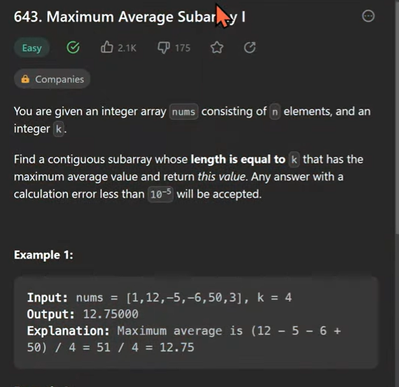
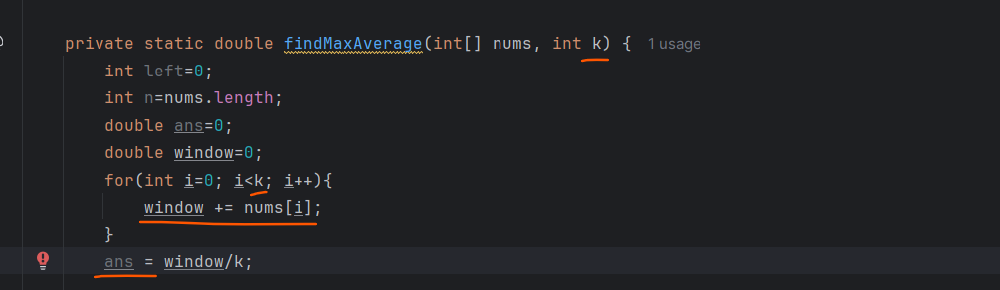
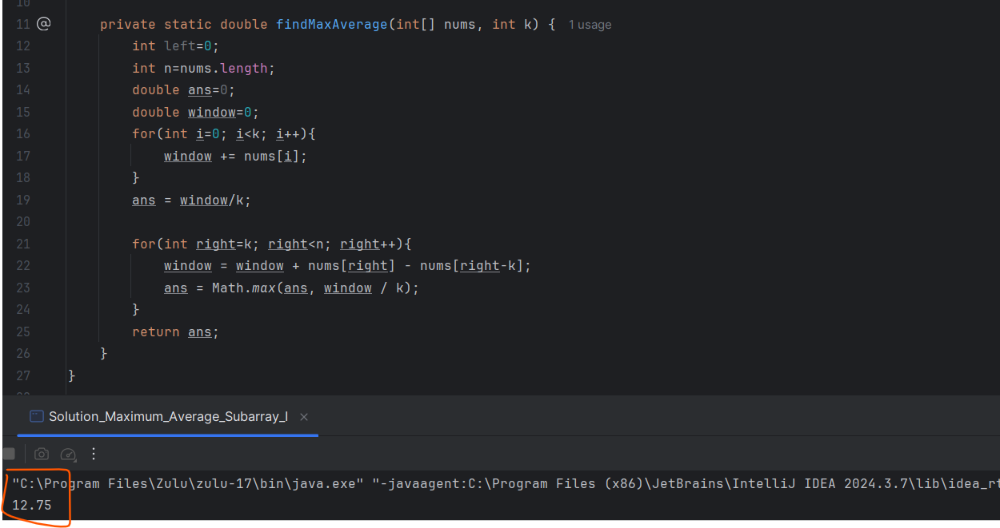

Maximum Average Subarray I

Given

   nums[] = {1, 12, -5, -6, 50, 3}
   k = 4

# we have to find a subarray of length k whose average is maximum.

suppose k=4, so at first time we have created a window outside a loop.
so starting 4 number sum we calculated and finding the average of it.

# Imp-
   The benefit of sliding window is no need to do the calculation at each and evey time on a subarray.
   we have to move the sub array so how we can do that we can just add the next right element and remove the first left element.
   so that's the reason we are taking a new loop starting from next index 5, so one by one next right index we will add to our sliding window 
   and remove from the left side position till where we can add we will add till nth element so, right index will from idx(5) to n. 

Time Complexity - O(n)
Space Complexity - O(1)

