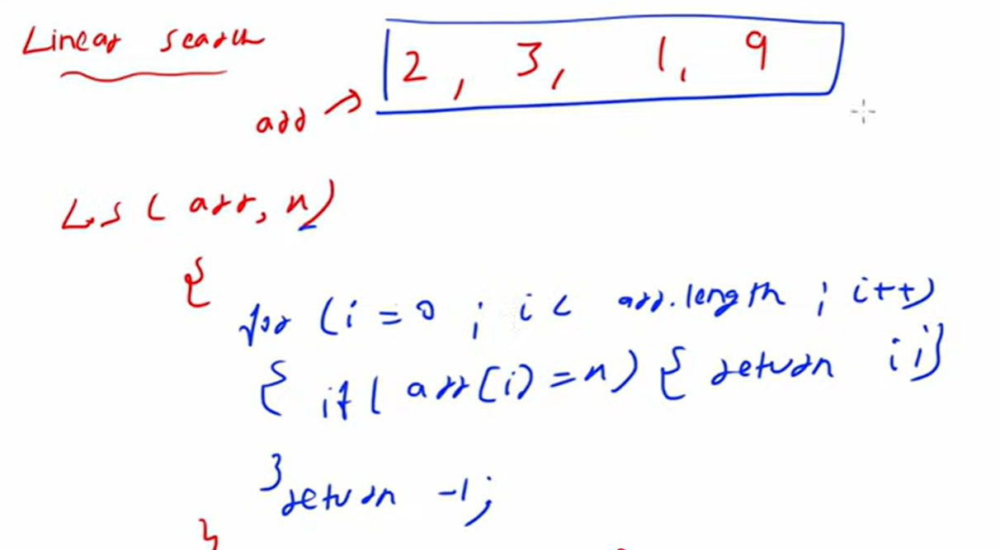

 # Array Advantage:

   1. Random Access 
            we can access using index randomly
   2. Cache Friendly
            neighbouring elements will store in a cache.
            while fetch arr[7]=99 and while trying to fetch arr[5] it will fetch from cache not from main memory
            the reason is it will store neighbouring elements in a cache so searching and accessing ll be fast.

 # Array Disadvantage:

   1. Fixed Size
        we give the size of an array during declaration.
        to add any additional element we have to declare new array and then copy the elements and then insert the elements.
        

   2. To resolve this issue we can use inbuilt data structure like ArrayList or LinkedList.

# Time Complexity:

# Linear Search

   - Linear search will apply on an unsorted array or a random elements in an array.
   - Time Complexity: O(n)  / Big O(n)

# Binary Search

   - Binary Search will apply on a monotonic data structure.
   - Monotonic means either in ascending order or a descending order.
   - Binary Search will apply on a sorted array.
   - 
   - 
   - Time Complexity: O(log(n))

