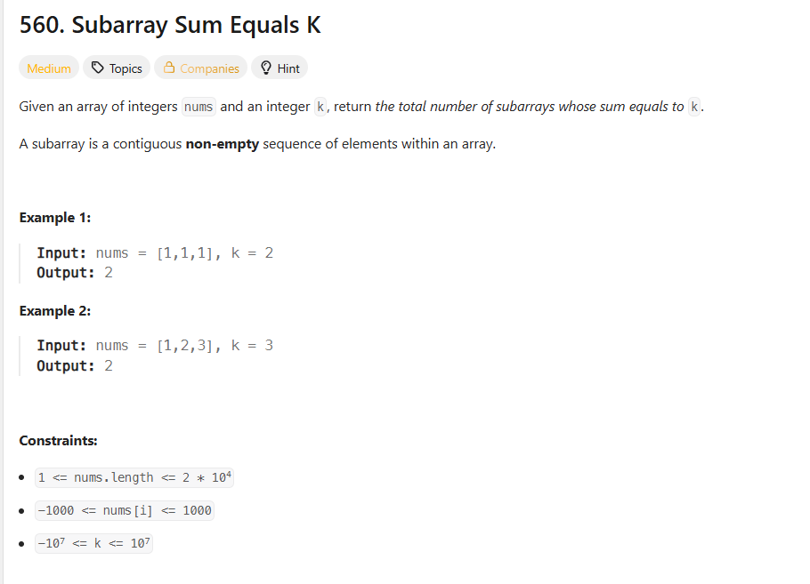
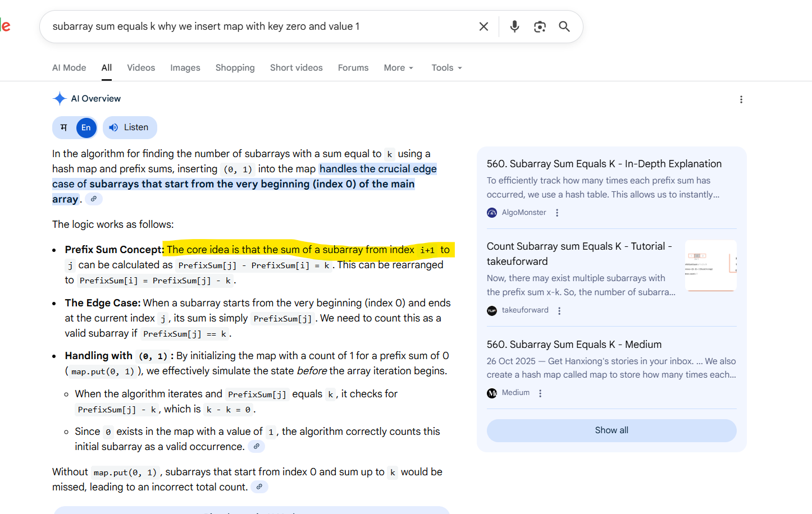
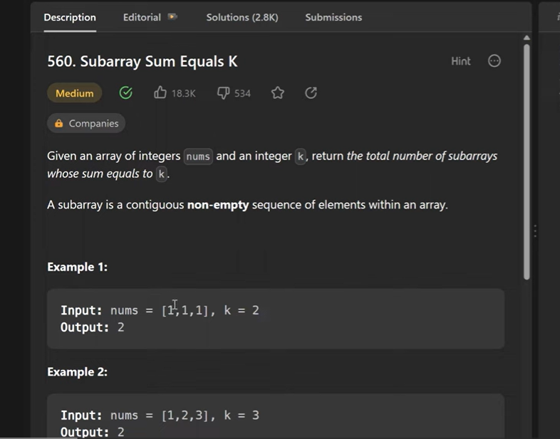
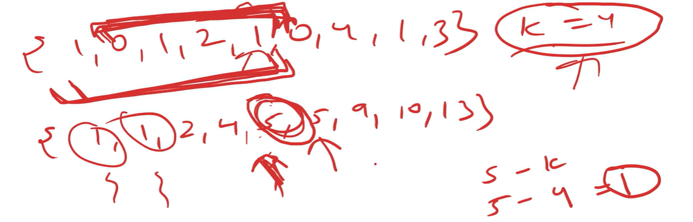
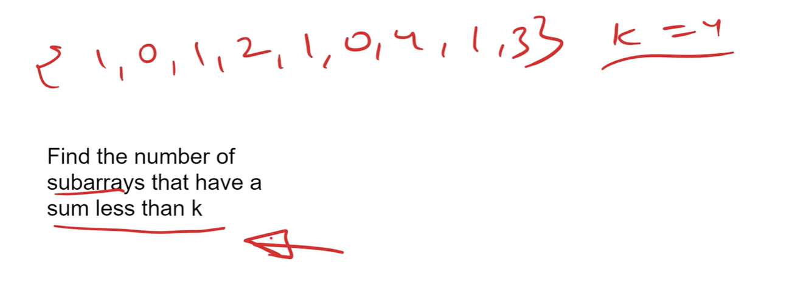

# Important Points (Use Map Vs Sliding Window)

# we are going to use Prefix - Sum with Hash Map

As we know whenever Sub arrays kind of Questions come you should always think about Sliding Window Approach

QQ: Find a number of sub arrays that have a sum less than k

constraint : sum less than K  -> (loose constraint)

In a Question If you have given more strict constraint then you have to think another approach other than sliding-window
In a Question If you have given loose constraint (less than/greater than given number )then you have to think sliding-window

first find prefix sum
then prefix sum - k
and count in a map how many times (prefix sum - k occurred)

Time complexity = O(n) bcz 1 loop
                  map.get() time complexity always 1 so O(n)+O(1) = O(n)