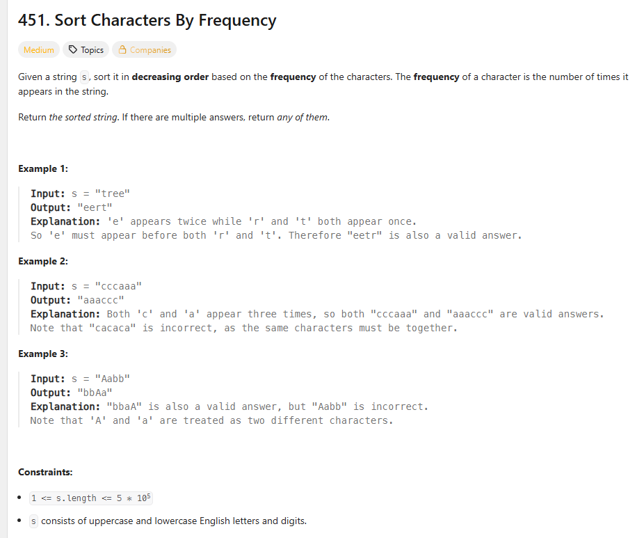
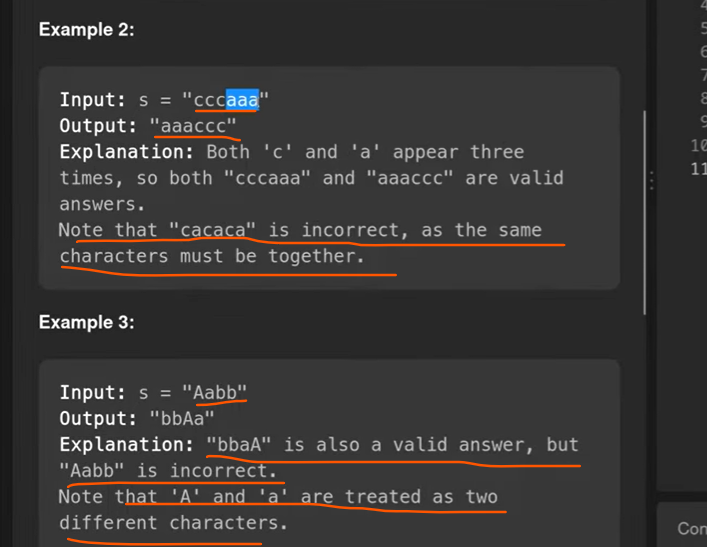
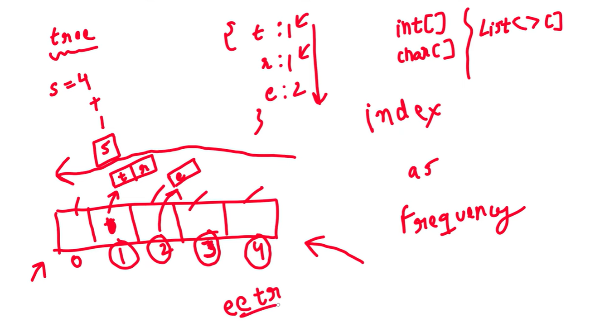
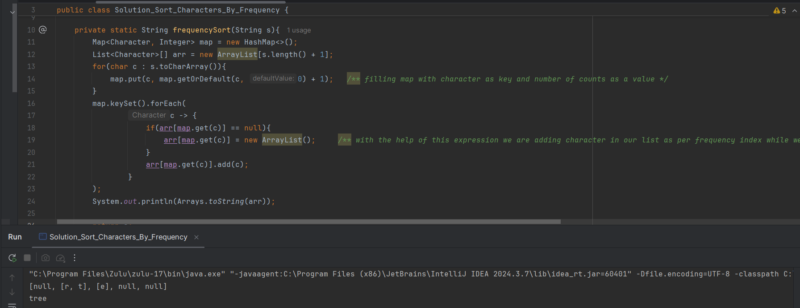
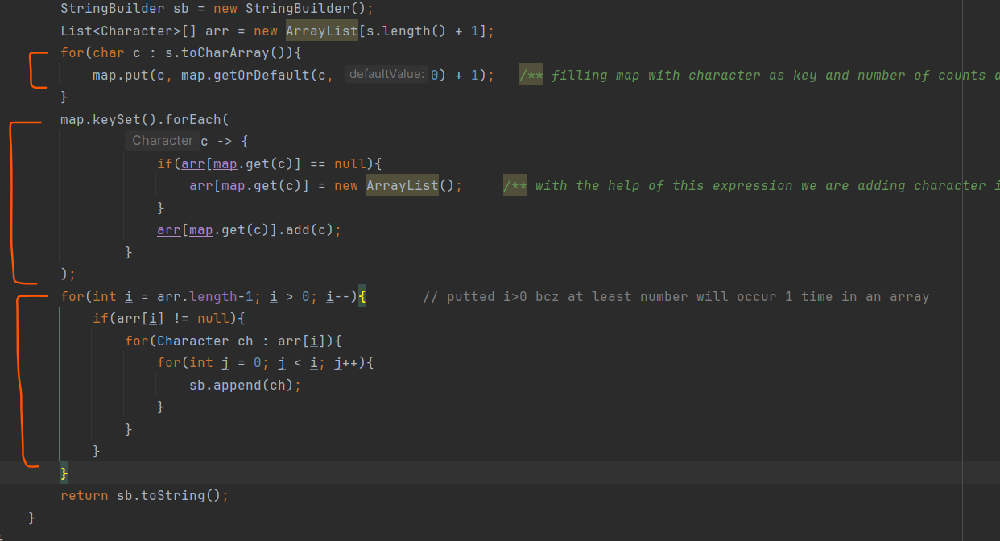

# Bucket Sort

** one way to solve this problem is take a LinkedHashMap and then sort based on frequency based on map value in decreasing order.

To solve this problem we are going to use a Best Approach - Bucket Sort.

# Concept : Introducing Count Array Concept to solve this problem

# Bucket Sort

 we are going to take an Array of size String Length size + 1;
String str = "tree";
Array length = 4 + 1 = 5
** We are taking Array Index as a Frequency
** We are taking Array of Type List so we are having List type of Array
** our list will be of type Character type

** No Need to do sort We can just print our Array in reversing order from right to left so automatically 
   maximum frequency character will get printed out first and then it will print frequency characters in
   descending order.

# Imp - our array is ready now

/** with the help of this expression we are adding character in our list as per frequency 
index while we initialize array default value in array will be null bcz array using list  */

# Bucket Sort

This AApproach is called Bucket Sort
Here 1 Index is our Bucket where we are putting an elements.
Array As Index as Frequency
At every Index there is a Bucket and we are putting an elements there
We say this approch a Bucket Sort.

# Time Complexity & Space Complexity

# Space Complexity
In StringBuilder we are storing the result so we can Neglect them
Then we have a Map with key character so suppose all elements are unique so map size will be N which mean equal to the string length
Array of List size we are keeping s.length(), so - N
Map and Array size is N
Buckets in an array suppose k unique elements so all k unique elements will get distributed in an array 
so Space Complexity - N + N = O(n)

# Time Complexity
we are creating a Map in time complexity Bio (n)
while fetching map using keySet suppose all unique elements then time complexity Big (n)

you were thinking because of 3 loops our time complexity will be n*n*n which is completely wrong.
How many times we are looking for a one character?
do we are looking for any character 2nd times No??
every each character is looking for only once so Time Complexity = O(n)
T C = n+n+n = O(n) = Big (n)

