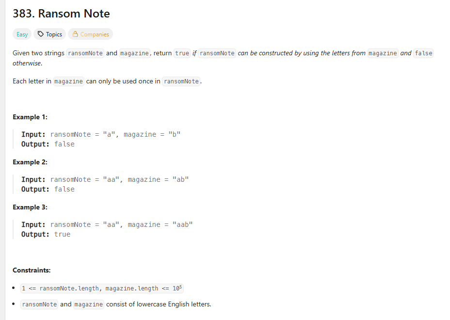
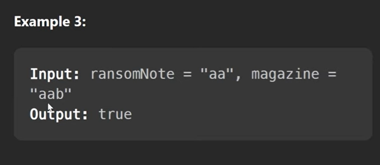

or we can solve this problem using Map ae well so just check 
In ransom map each character with number of count and
In magazine map each character with number of count

so take ransomNote number of character count and compare with in magazine having same count or not