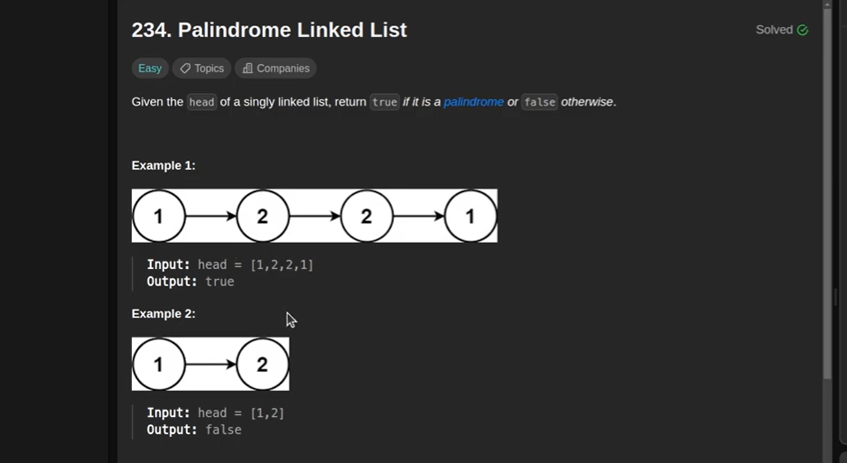

# Iterative Approach

Here is Java code to determine if a singly linked list is a palindrome. 
This approach involves finding the middle of the list, reversing the second half, 
and then comparing the first half with the reversed second half.

# Recursive Approach

A recursive approach to check if a singly linked list is a palindrome in Java involves 
passing a reference to the head of the list as a "left" pointer that moves forward during the recursion, 
and the current node in the recursive calls acting as a "right" pointer that moves backward implicitly.

