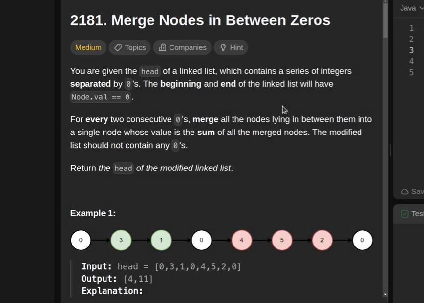

The following Java code provides a solution for the "Merge Nodes in Between Zeros" problem 
(LeetCode 2181), which involves summing nodes between consecutive zeros in a linked list. 
The solution utilizes a two-pointer approach and a dummy node for efficient construction of the new list. 

