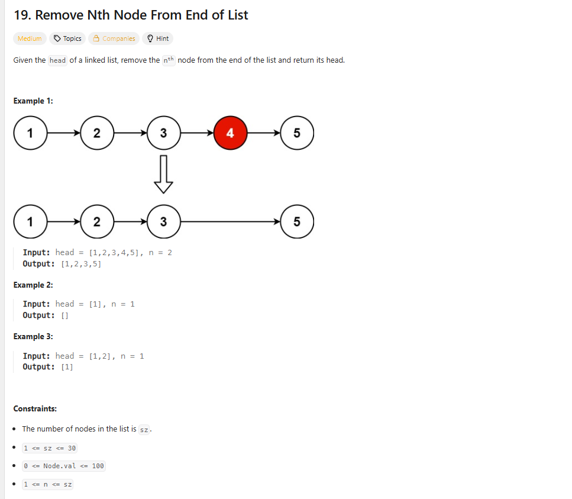
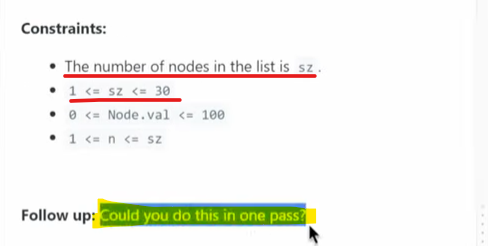

# Why should I do in one pass
List : 1 2 3 4 5 6

 Reason : The Reason is to do this in one pass is suppose we have 6 nodes in our list, and we want to delete 3rd node from
          last position which would be 4, but In between If someone added one node(99) at the end then the 3rd last element
          will become 5 which will be wrong that's the reason we should this in one pass.

# Approach : fast and Slow Pointer

    To remove the nth node from the end of a singly linked list in Java, a common and efficient approach 
    involves using two pointers, often referred to as "fast" and "slow" pointers. This method allows for 
    a single pass through the list.

1 2 3 4 5 6 7 8
s     f
n-3 which mean 6