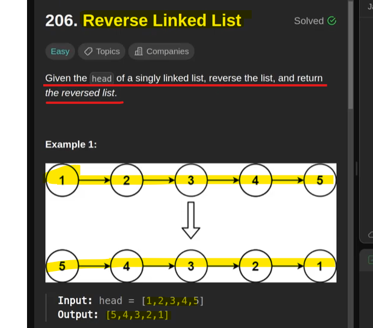
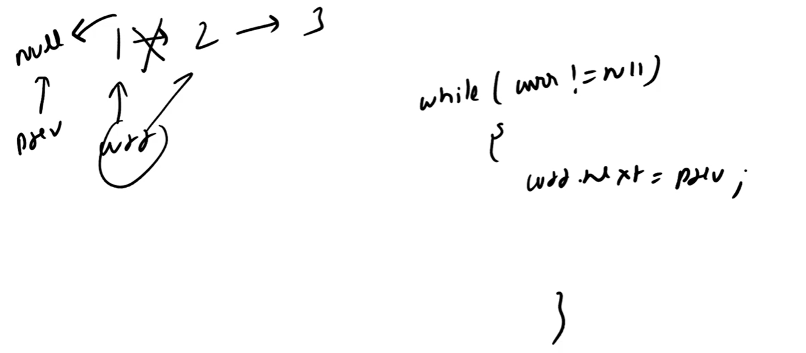

you have to reverse a Node not the value *********

# Iterative Approach

# Important Concepts:

   we have a given a Head of a Linked List
   we are taking a pointer current from a head and then start moving forward
   
   so when current reaches to node 2 then we take next pointer of node 2 from node 3 to node 1
   But node 1 where we have stored it? No where right?? which mean we have to take 1 more pointer Previous which will be on null
    
   While we will do current.next = Previous then node 3 link will get break then how we will more traversing forward
   
   
   which mean we have to take 1 more pointer which will be pointing to current.next node
   so, Now we have to take 3 pointers.

   current->
   previous->
   next->

  # steps:-

           // Store the next node
           // Reverse the current node's pointer
           // Move 'previous' one step forward
           // Move 'current' one step forward
           // 'previous' will be the new head of the reversed list

Time Complexity - O(n) - Big of N
Space complexity - we did not took any space so constant O(1)

# Recursive Approach

        // Base case: if the list is empty or has only one node, it is already reversed
        if (head == null || head.next == null) {
            return head;
        }

        // Recursively reverse the rest of the list starting from head.next
        ListNode newHead = reverseListRecursive(head.next);

        // Reverse the link: make the next node point back to the current head
        head.next.next = head;

        // Set the current head's next pointer to null, as it will be the last node in the reversed list
        head.next = null;

        // Return the new head (which is the original tail of the list)
        return newHead;
    }

