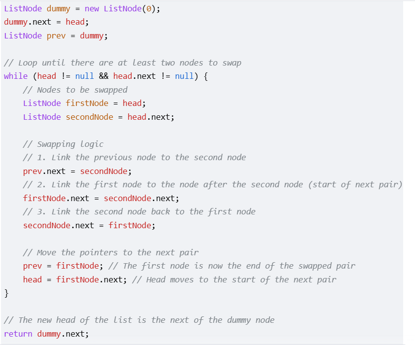

# Iterative Approach

The iterative approach uses a dummy head to simplify edge cases and a prev pointer to link the 
previously swapped pair to the current pair.

# Recursive Approach

The recursive approach is concise and elegant. It swaps the first two nodes 
and then recursively calls the function for the rest of the list. 

TC - O(n)
SC - O(1)