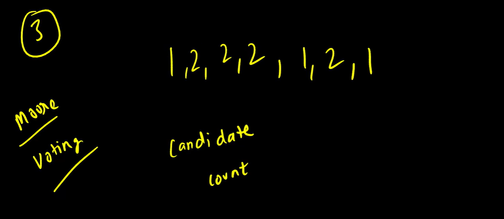
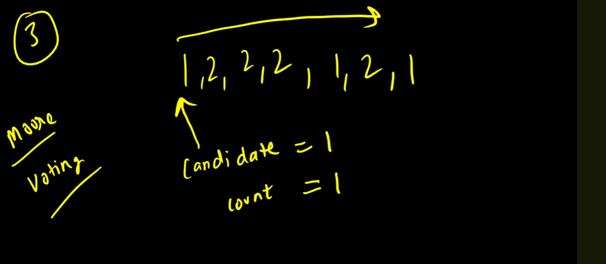
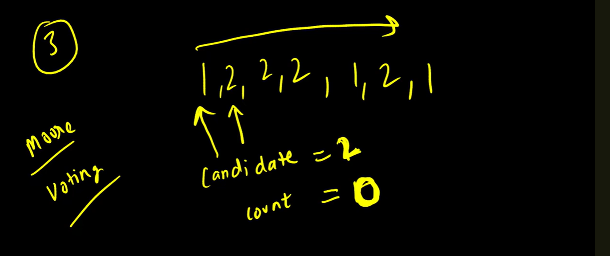
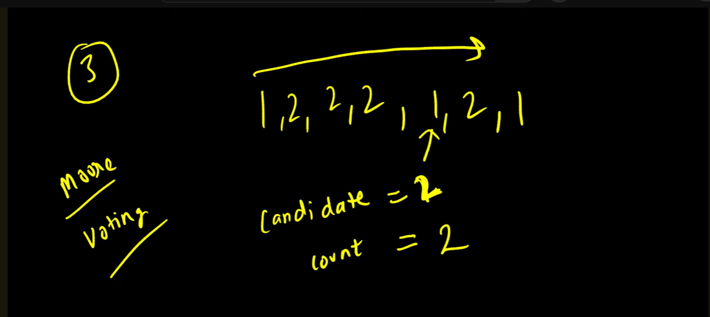
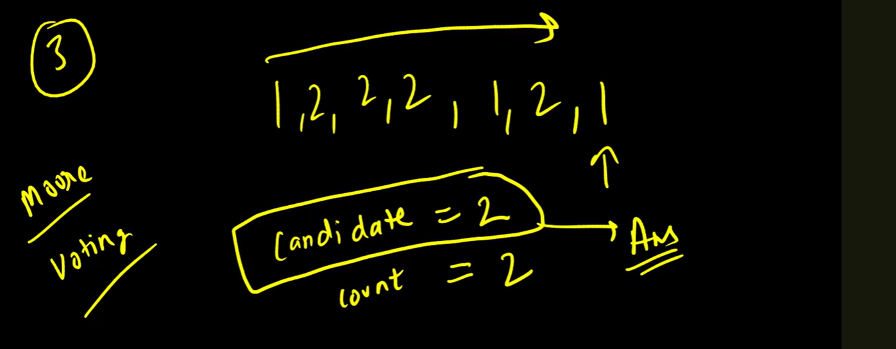

In a sorting way we can solve it but tc will be n log n

# Algorithm : Boyer-Moore Majority Voting Algorithm

T C - O(n)
S C - O(1)

In Moore Voting algorithm we take a Candidate and a Count

we will put a loop simply and candidate we will make equally same as a current element 
and this candidate count is also 1

when the next element will come will check is the current element equals to candidate If
current element not equal to the candidate we will reduce the count by 1 

now the candidate will become 2 so, now the candidate will be 2 and count will be 1 

now when it comes to 1 again once we check is the current element equal to candidate
no so reduce by 1

now candidate won't be change because count is not reaches to 0. 
** so, until count not reached to zero the candidate will remain same.

now we reached to the end of loop and still candidate not become zero so answer will be candidate: 2 in this case.

# Conclusion :

    From the occurrences of Majority elements If i delete the other numbers occurrences then at the
    end also the candidate value will be majority only.

# Majority Elements Occurrences will be Greater than the all other number occurrences combines

# So, Candidate will not be changed by other elements because that candidate count never become zero.

