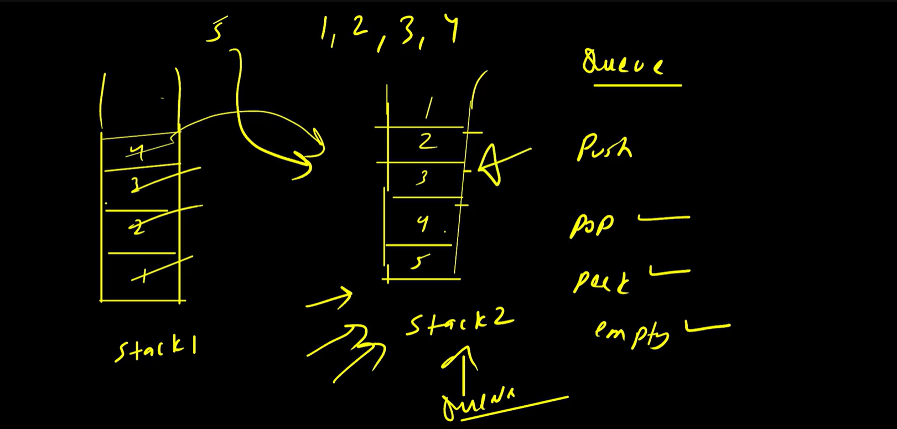
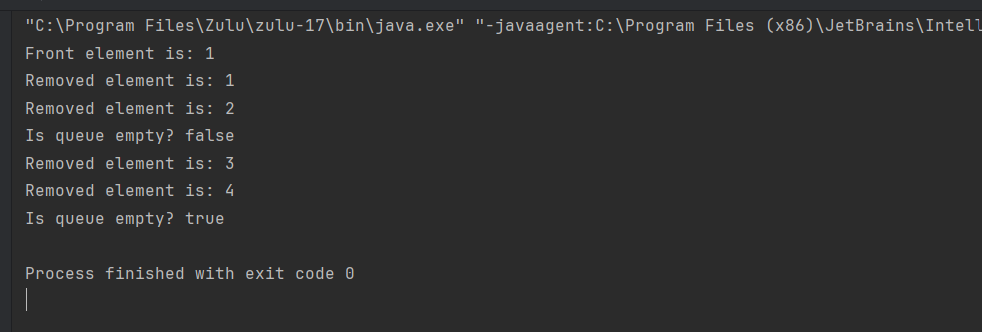
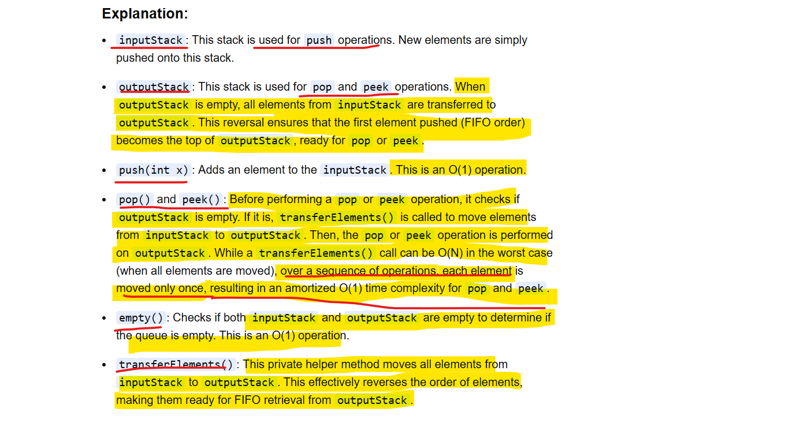

# Approach - 1

In stack 1 we are pushing 1, 2, 3, 4
while we pop first it should come 1 as per Queue FIFO

while we popped from stack 1 and pushed into stack 2 will become 4, 3, 2, 1 and then while we pop will come 1 it become 
Queue and work like a Queue

Now Pop, Peek and empty check will happen at stack 2 bcz works like a Queue then what is use of Stack 1

Suppose 5 come so it should go to the end of stack 2 bcz it should pop at the last, so In stack while we
push always it will go to top not at the last

so whenever any new elements will come then pop existing elements from stack 2 and push into stack 1 
then push current element 5 and then pop from stack 1 and push into stack 2

So finally Stack 2 will be Inverted into Queue
** we will always pop from stack 2.  -> stack 2 become a Queue

Note  TC :-

   But here every push time complexity will be O(n) 
   except 1 element every elements getting 2 times pushed and popped out. 

   If in stack 2 n elements so for push operation TC will be O(n)
   push - O(n)
   pop - O(1)
   peek - O(1)
   
   SC - also O(n) because we used helper stack 1

# Approach - 2

Here is a Java implementation of a Queue using two Stacks, often referred to as the "amortized O(1)" approach for pop/peek operations.

