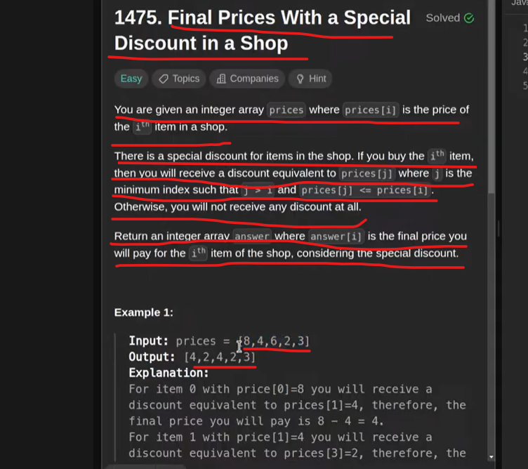

# monotonic increasing stack

whenever we are finding small element from a right of current element in that case we found answer
but whenever we are not finding any greater element in right side we are just keeping that element
with us so will introduce monotonic increasing stack.
ex- int prices[] = {8,4,6,2,3}; , so 4 and 6 keeping in mis.

