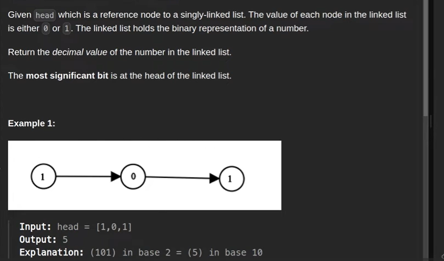
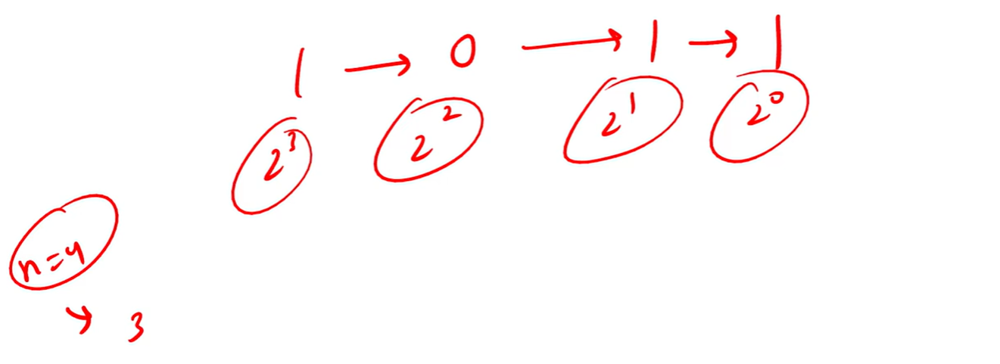

Below approach will do in 2 iteration, like first need to find the length and we can iterate like below  2 to power length-1, 2 to power length-2....

# But we want in one Iteration

# Tricky Part

0 1 1

step -1
suppose we are having 1st node is the last node so - 0 * (2 to the power 0) = 0 * 1 = 0 , result = 0

step - 2
Then when we move to next node then we assume next node(2nd) is the last node so we will multiply old result with 2  and add current result= 1 * (2 to the power 0) = 1*1 = 1
and for a previous node we will multiply with 2 in the previous result so, result = 2 * 0 + 1 = 0+1 = 1 

step - 2
Then when we move to next node then we assume next node(3rd) is the last node so we will multiply previous result with 2  and add current result= 1 * (2 to the power 0) = 1*1 = 1
and for a previous node we will multiply with 2 in the previous result so, result = 2 * 1 + 1 = 3
