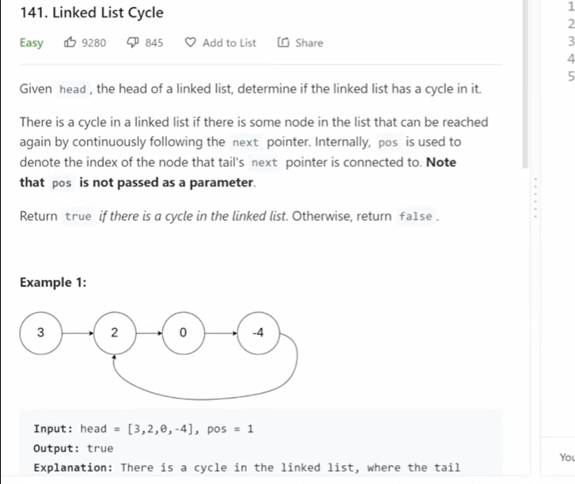
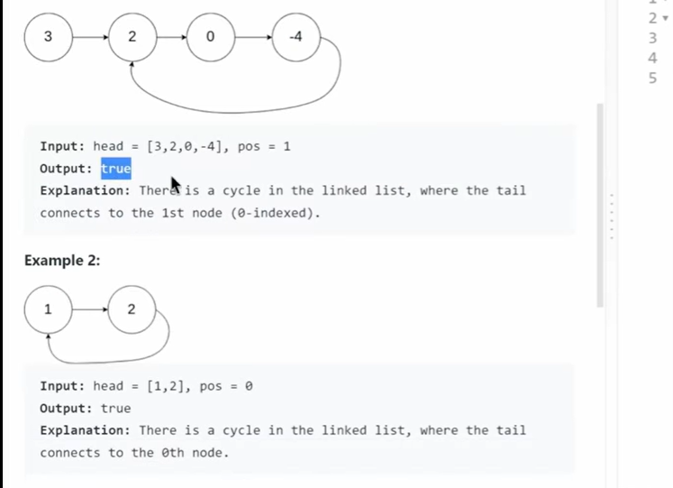
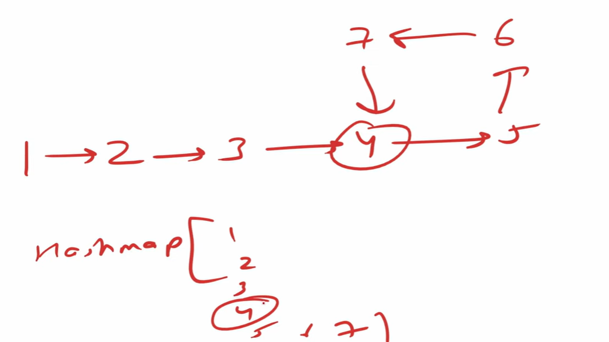
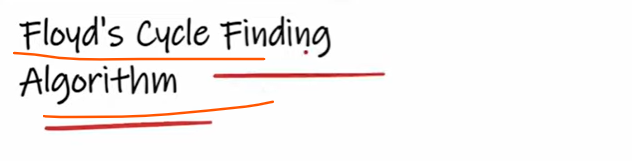

# To solve this problem we can use here Map and can store 1,2,3,4,5,6,7 and validate is the node next pointer pointing to the elements
  whose key already contains in a map?? If Yes then Cycle If not Then Not forming a Cycle.

but
# the problem is Space complexity space will occupy O(n) how many elements we are pushing into a Map

# so simply occupying unwanted space
  
# so space complexity should be Big (1)

# Let's solve this on Space O(1)

# To solve this we can use 

# Approach : Fast and Slow Pointer

Java program implementing Floyd's Tortoise and Hare algorithm to detect a cycle in a linked list  ###
--
 -> Tortoise moves one step ###
--
 -> Hare moves two steps  ###
---

#  If the fast pointer reaches null, there is no cycle

    Floyd's Tortoise and Hare algorithm detects a cycle in a linked list by using two pointers, 
    a slow pointer (tortoise) moving one step at a time and a fast pointer (hare) moving two steps at a time. 
    If a cycle exists, the two pointers will eventually meet at the same node; otherwise, the fast pointer will 
    reach the end of the list (null). 

