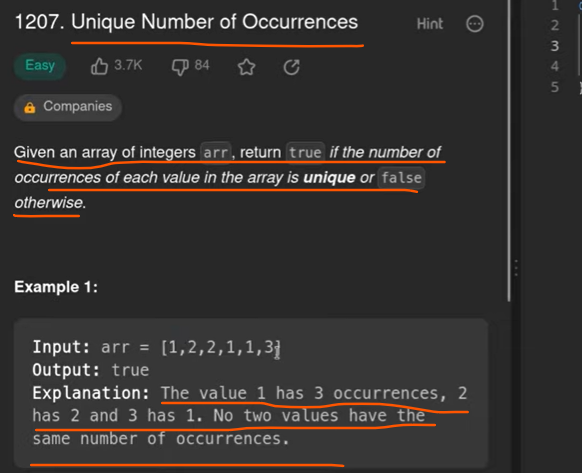

1 way we can use HashMap with number occurred and number of count

2nd way is we can use count Array, so array elements will become an index of a count Array and there we kept their frequency.

since we have a constraints limit from -1000 to 1000 but in array we can't initiate -ve index because index starts from 0
so what we can do we will add 1000 so instead of -1000 to 1000 will become 0 to 2000.

# Important:

If we see the limit constraints given in a problem we should always prefer to use count array approach.

-1000 to 1000 
   will become 
0 to 2000

Space Complexity : As we took Array of size 2001, so it will be constant size
                   suppose if we have k elements so S.C = O(k)

Time Complexity : 1 loop iterating n times
                  we sort the ca so TC = n + k log (k)  , k log for sorting
                  final will be n + k log k + k = n + k log k

                  