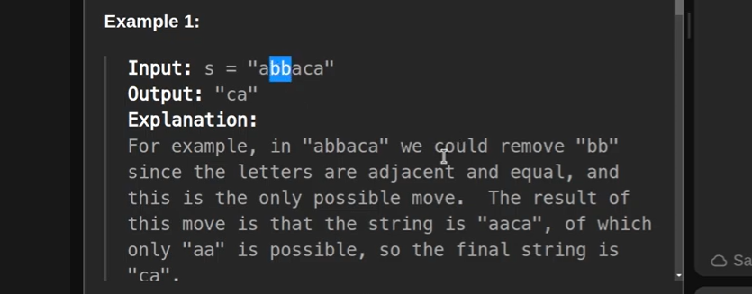
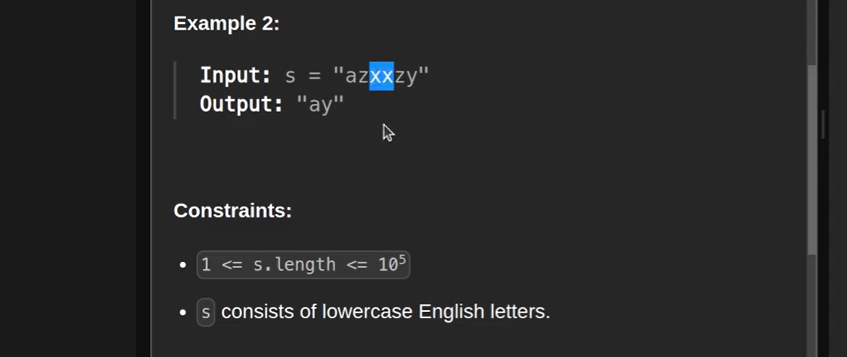

we can solve this pattern problem using Stack

-> Stack we can Implement in a multiple way either we can use Stack class or we can use String Builder

-> pop the element from a stack and compare if it is equals to the current element then pop it if not then push it
   and then convert stack to a string to show non-adjacent duplicate element.

Time Complexity - O(n)

Space Complexity - O(n)

