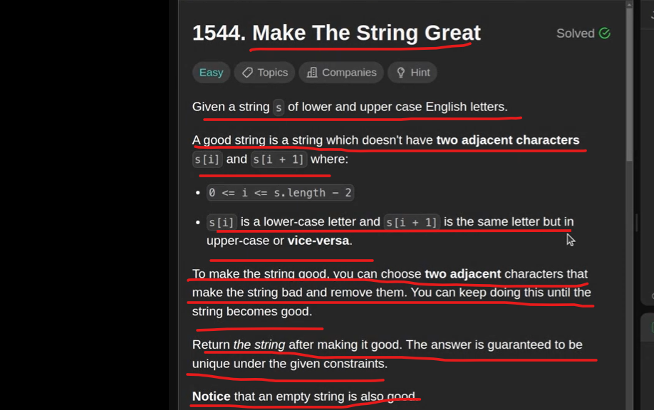

If 2 adjacent letter is same but opposite in lower/upper case need to remove.

If 2 adjacent letters are same and both are in either upper or lower case we can keep it.

Let's solve this using STACK

when we see a new Letter we will check top element of stack either both the letter is same but in different cases
If yes then we will pop out if not then we will push into it.

If the letter is same but in different cases then the difference value will always be # 32.

which mean small z and capital Z difference will always be 32.

Because 97 - 65 = 32 => A(65) & a(97)

