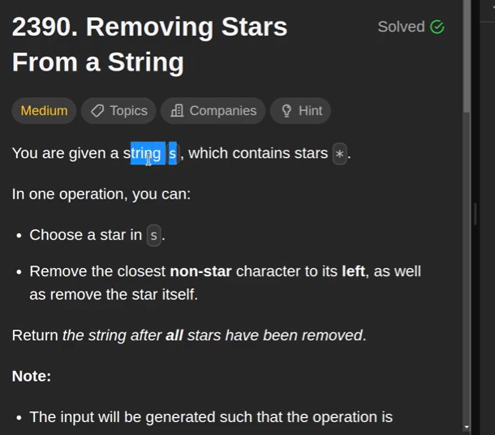
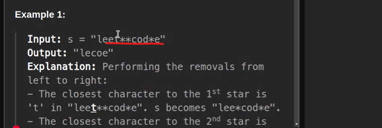
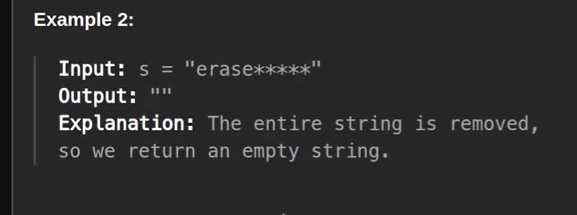
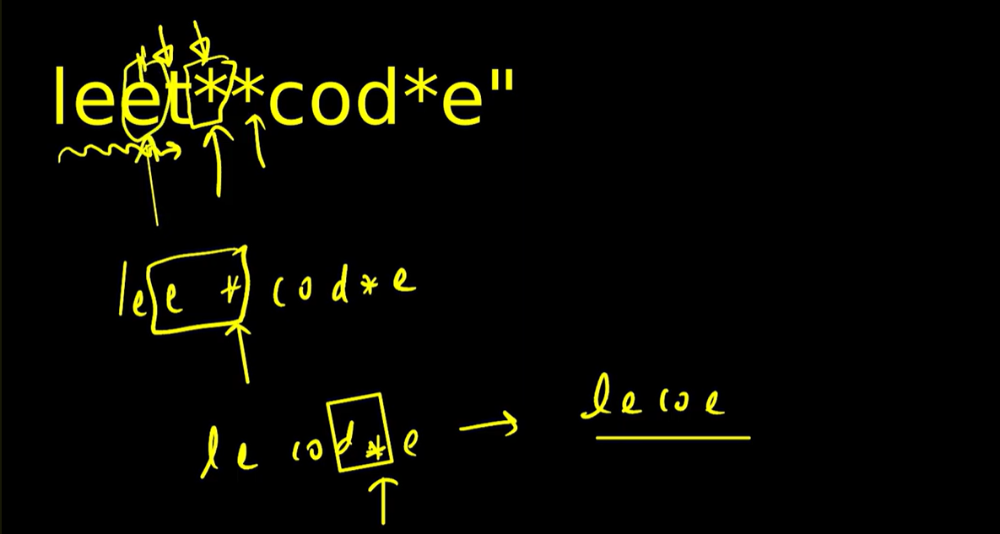
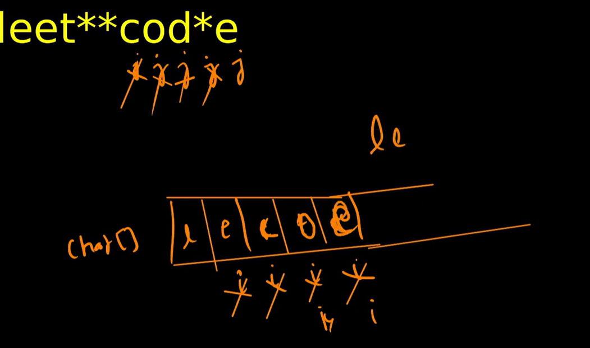

** When we do not know in future which elements will come we can take stack in that case

** so In stack we will push as soon as * will come we will pop

** StringBuilder also we can use as a STACK bcz there will be a method 

** Unlike String String Builder is a Mutable so we can use it
//TC and SC - O(n) bcz we are pushing in sb and based on starts we are popping

2nd Way
========

we can take 2 pointer i and j
i and j will point to the 1st character
j will be the main pointer for traversal
whenever j will see non-star then will put into character array and character i and j will move forward
and whenever j will see star character the move backward i with one step back word direction.

