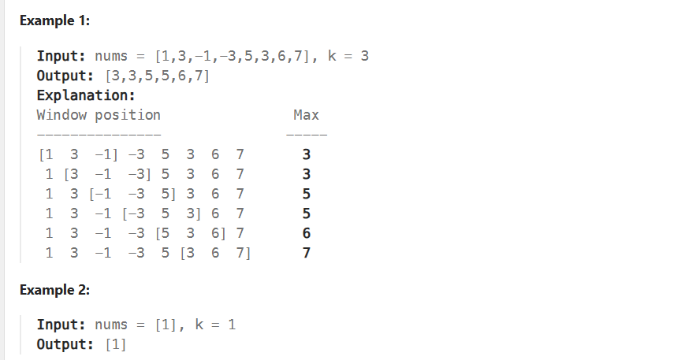

Maximum number always be on a top of Queue because in a windows of 3 in a queue the number which is smaller in size
but in left side not required because we want maximum from a window of size 3, so when we slide the windows so
next element will get added and the smaller elements from the windows is not required so maximum size element 
will always be on a top of queue so we will compare always from top element.

# Imp

   Our answer will always be on top. 
   So we will always see the top of a Queue and put into Queue.
   Now we are checking and comparing current element with a elements inside a queue.
   So when Queue elements smaller than we are popping.
   So Here Monotonic Queue will be created in a Decreasing Order.

   
