If you want to judge the algorithm which you are writing is Efficient in terms of Time and Space as well.

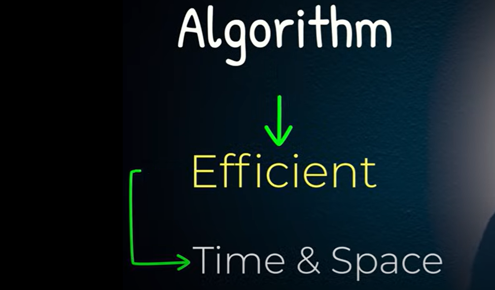

** So As your Data Increases It should not Increase your time exponentially. 

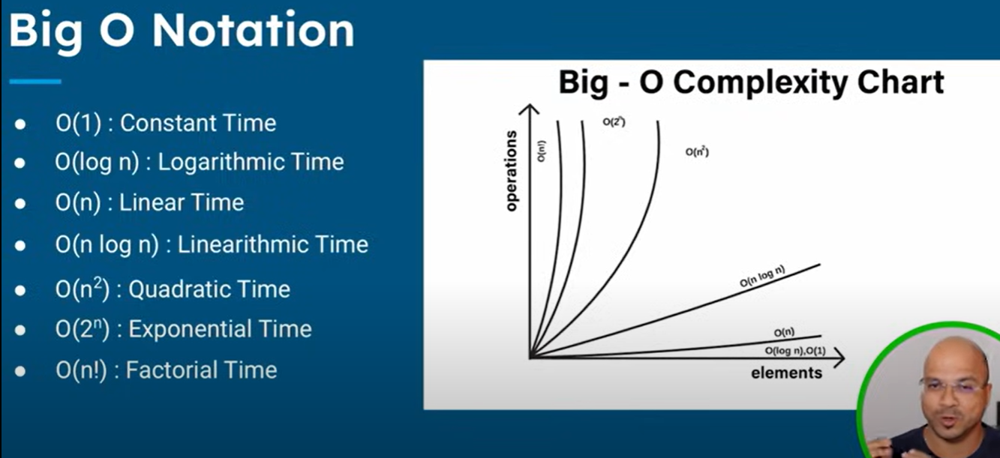

Linear Search
--------------

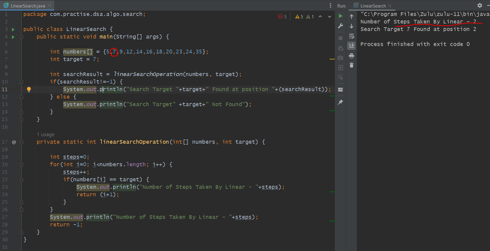

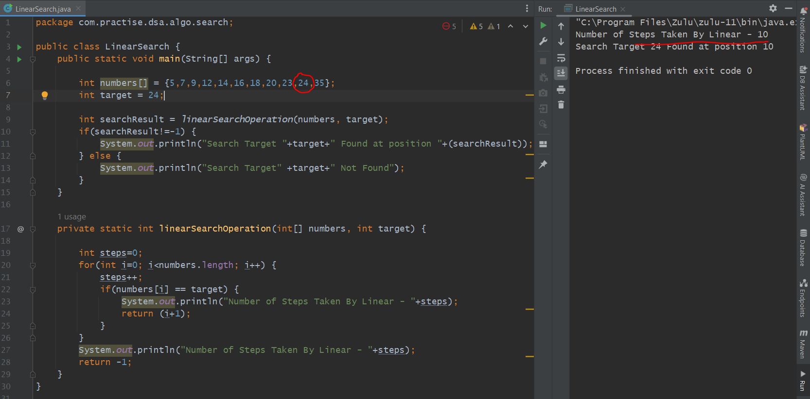

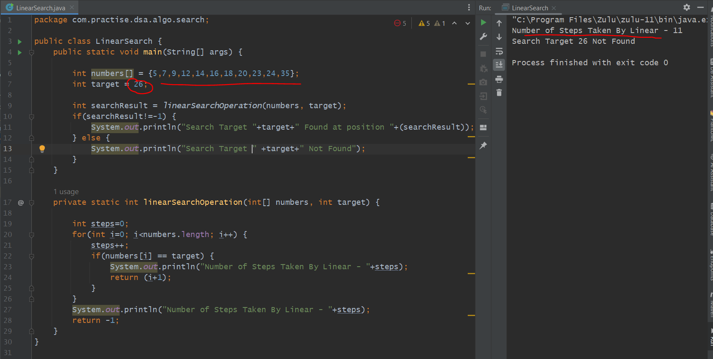

Binary Search
-------------

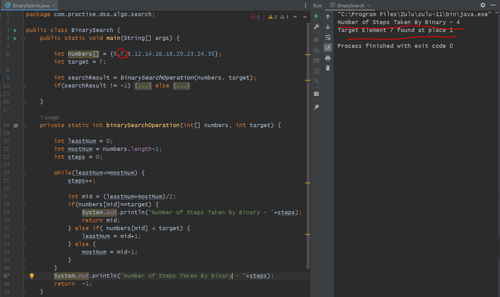
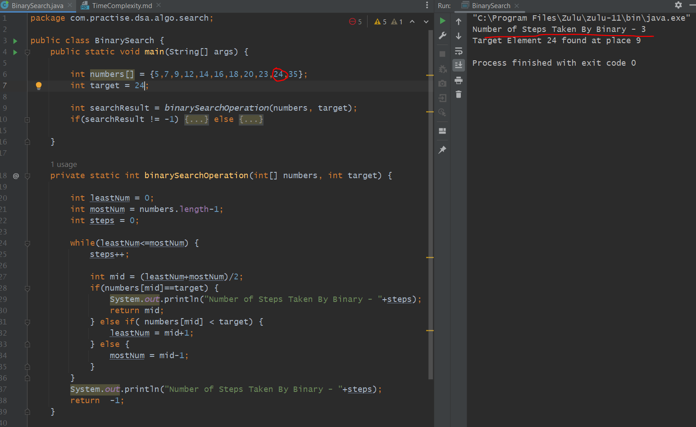
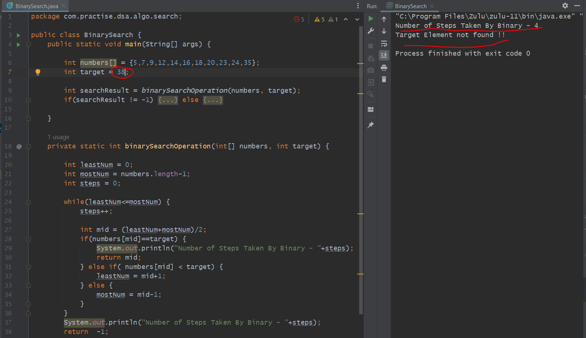

Time Complexity Comparison
--------------------------

Linear
======

    If we have 10 elements in Linear search it takes 10 steps.

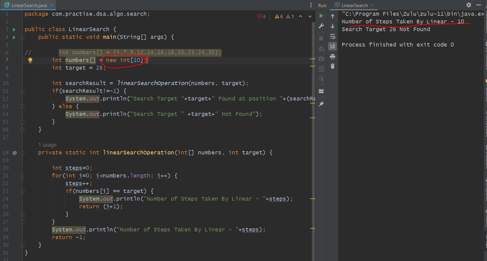

    If we have 20 elements in Linear search it takes 20 steps.

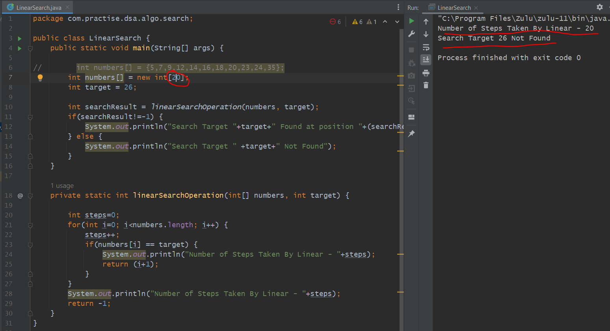

    If we have 100 elements in Linear search it takes 100 steps.

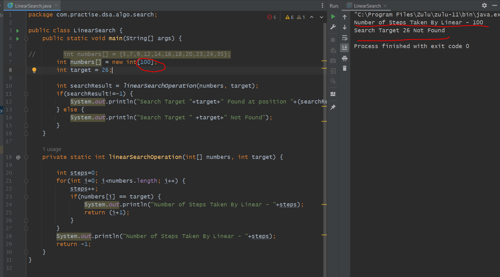

Binary
======

    If we have 10 elements in Linear search it takes 10 steps.

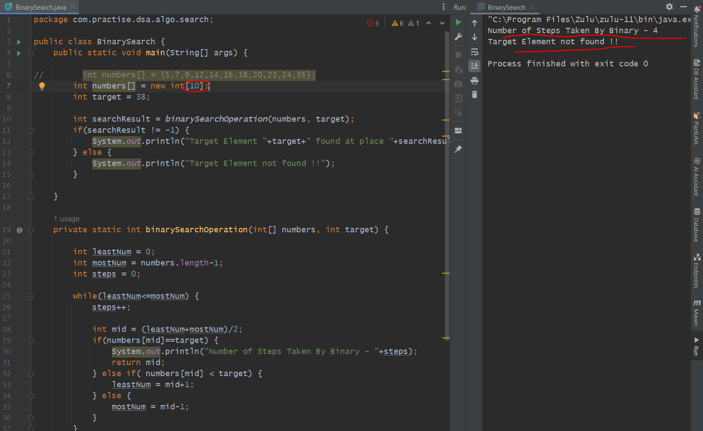

    If we have 20 elements in Linear search it takes 20 steps.

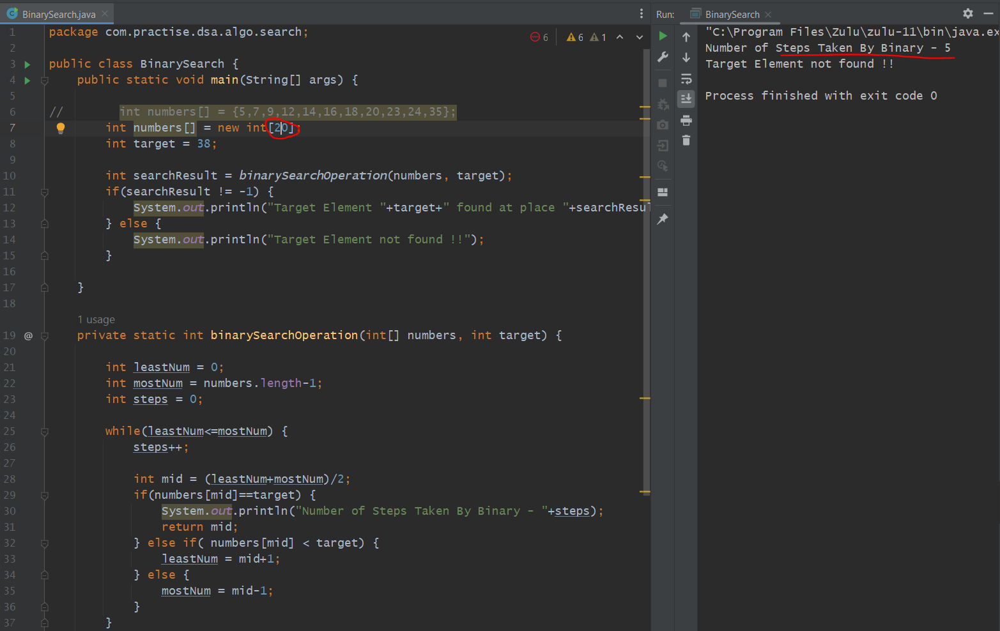

    If we have 100 elements in Linear search it takes 100 steps.

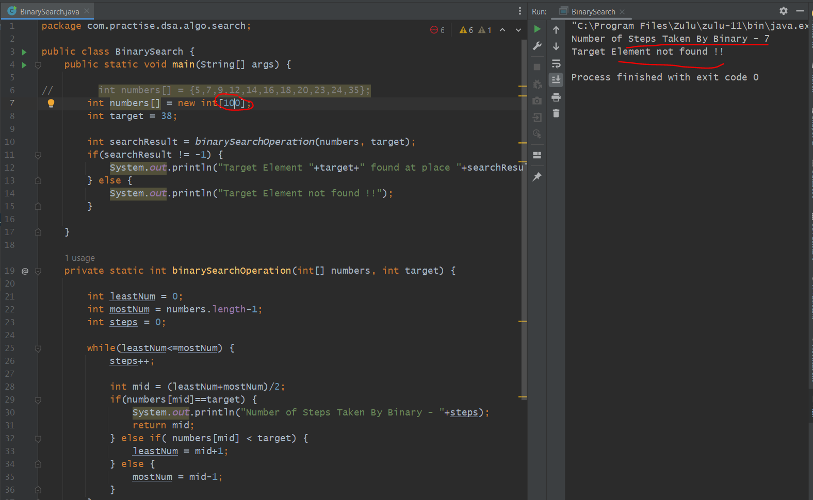

                                    Summary
                                    --------

Every time while we double the values Linear Search will take double no. of steps to perform 

while Binary Search will take only 1 more extra step that's why it's Big O notation is O (log n)

Linear  -   O(1) constant      -> If element found at first Place
Linear Worst Case -   O(n)     -> If element found at end or any other location other than first place.

Binary - O(log n)              -> while we double the value it only can take one extra steps.

    In this Case  Binary Search works Better than the Linear Search.

Recursive (Binary Search)
=========================

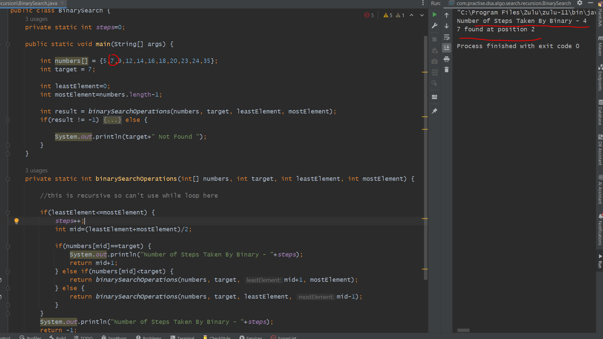

