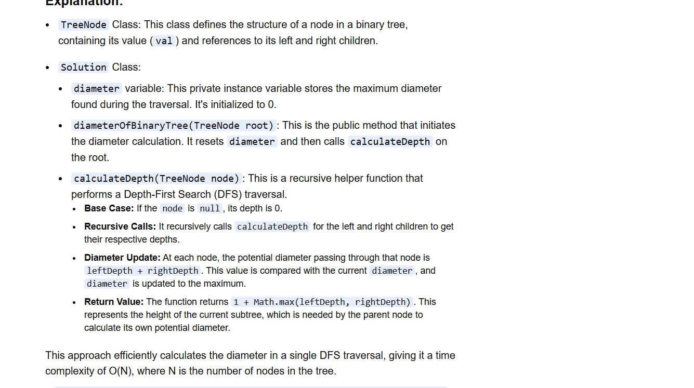

Diameter - Longest distance between 2 nodes not necessary root get included.

diameter: length means edges 

here longest path we have is without root node

If we are able to find Longest path in Left and Right Subtree then we will get the answer.

