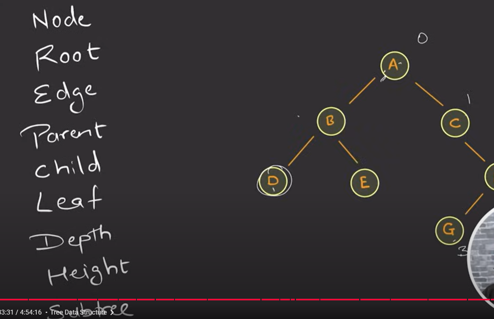
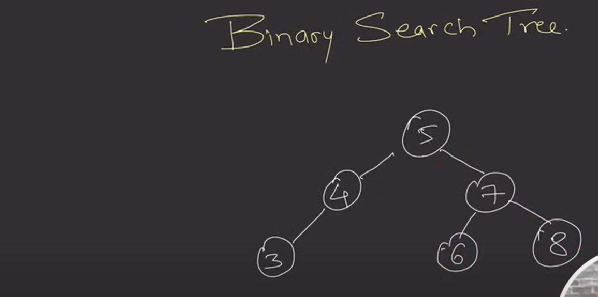
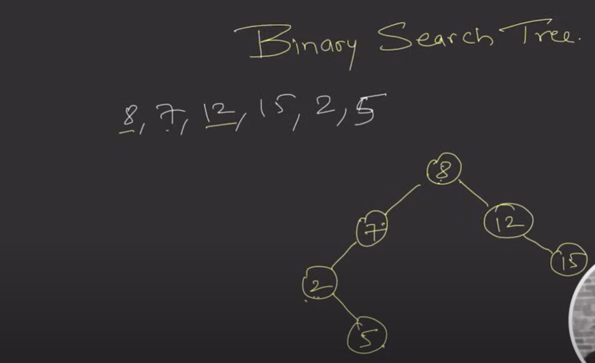
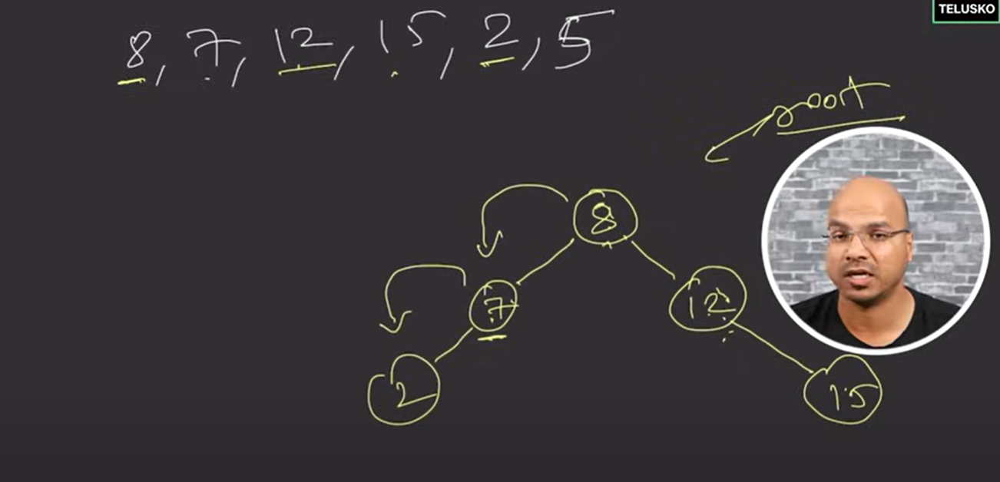
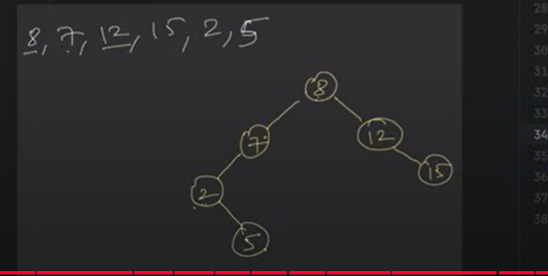
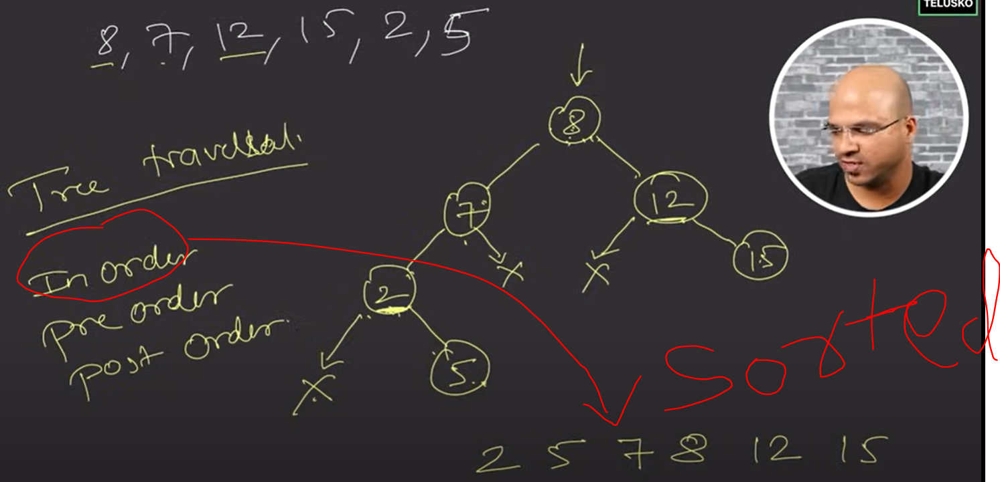

 
 
  =>  Tree is not like a Linear Data Structure. Tree is a Hierarchical Data Structure.
  
  
  
  
  
  

  

    Now the Tree is created , but how we are going to print there are 3 way to traversing Tree and printing
    -Preorder
    -Inorder
    -PostOrder

  
  
  this is the Tree-
    
  
  Tree Traversals-
  
   
   
  
  
     BST always be in sorted order for Inorder Traversal.

  
  Input
  -------
 8  7  12  15   2   5

-------Inorder-----

2 5 7 8 12 15
-------PreOrder-----

8 7 2 5 12 15
-------PostOrder-----

5 2 7 15 12 8 

Code Implementation
---------------------

    package com.practise.dsa.algo.tree;

class Node {

    int data;
    Node left;     //generally in Node having 2 things data & ref of Node
    Node right;    // but here 3 things data & Left Node & Right Node
    Node(int data){
        this.data=data;
    }
}

/**
*       every tree is having 1 root-node, every time when you insert a data we need to hold on a root.
  *      so (In Recursive way) recursively we are holding a root node and inserting left and right node,
    *       every time root element is getting change while we are trying to inserts
      *     so recursion will return a root node
         */
        * 
                public class BinaryTree {

                Node root;

                 /** Inserting ****/
                 private void insert(int data) {
                 root = insertRec(root, data);
                 }
    
                 private Node insertRec(Node root, int data) {

                 if(root==null)
                     root = new Node(data);
                 else if(data < root.data)
                     root.left = insertRec(root.left, data);
                 else if(data > root.data)
                     root.right = insertRec(root.right, data);

                 return root;
                 }
    
                 /** Printing or Traversing- InOrder */
    
                 public void inorder(){
                 inorderRec(root);
                 }
    
                 public void inorderRec(Node root){

                 if(root!=null){
                     inorderRec(root.left);
                     System.out.print(root.data+" ");
                     inorderRec(root.right);
                 }
                 }
    
                 /** Printing or Traversing- PreOrder */
    
                 public void preorder(){
                 preorderRec(root);
                 }
    
                 public void preorderRec(Node root){

                 if(root!=null){
                     System.out.print(root.data+" ");
                     preorderRec(root.left);
                     preorderRec(root.right);
                 }
                 }
    
                 /** Printing or Traversing- PostOrder */
    
                 public void postorder(){
                 postorderRec(root);
                 }
    
              public void postorderRec(Node root){

               if(root!=null){
                   postorderRec(root.left);
                   postorderRec(root.right);
                   System.out.print(root.data+" ");
               }
           }

    public static void main(String[] args) {

        BinaryTree binaryTree = new BinaryTree();
        binaryTree.insert(8);
        binaryTree.insert(7);
        binaryTree.insert(12);
        binaryTree.insert(15);
        binaryTree.insert(2);
        binaryTree.insert(5);

        System.out.println("\n-------Inorder-----\n");
        binaryTree.inorder();

        System.out.println("\n-------PreOrder-----\n");
        binaryTree.preorder();

        System.out.println("\n-------PostOrder-----\n");
        binaryTree.postorder();
    }

}
